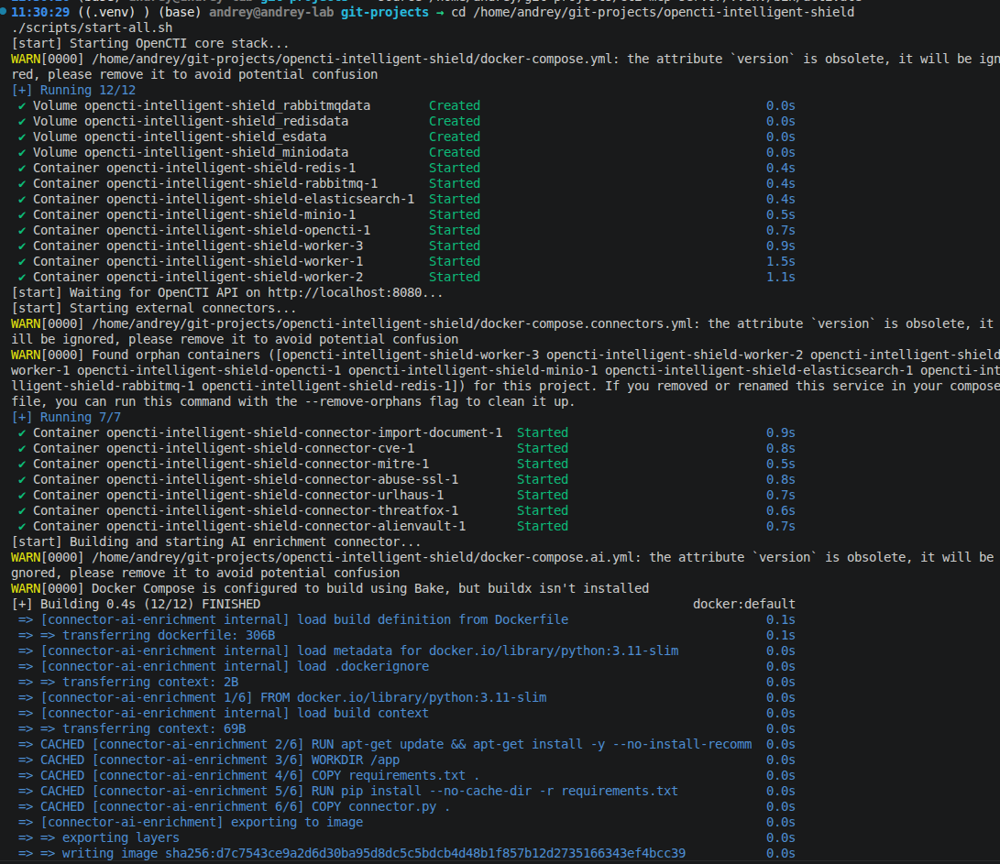
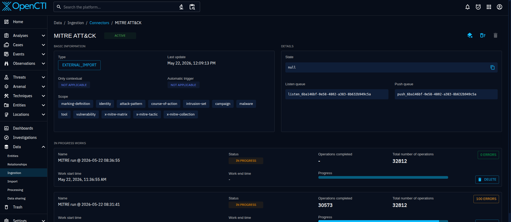
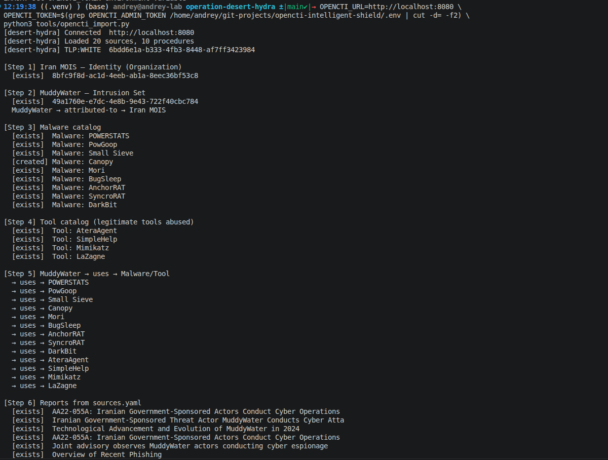
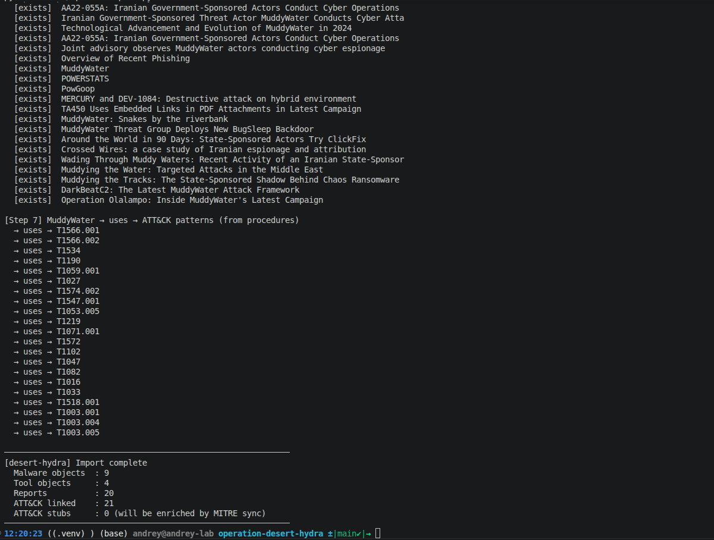
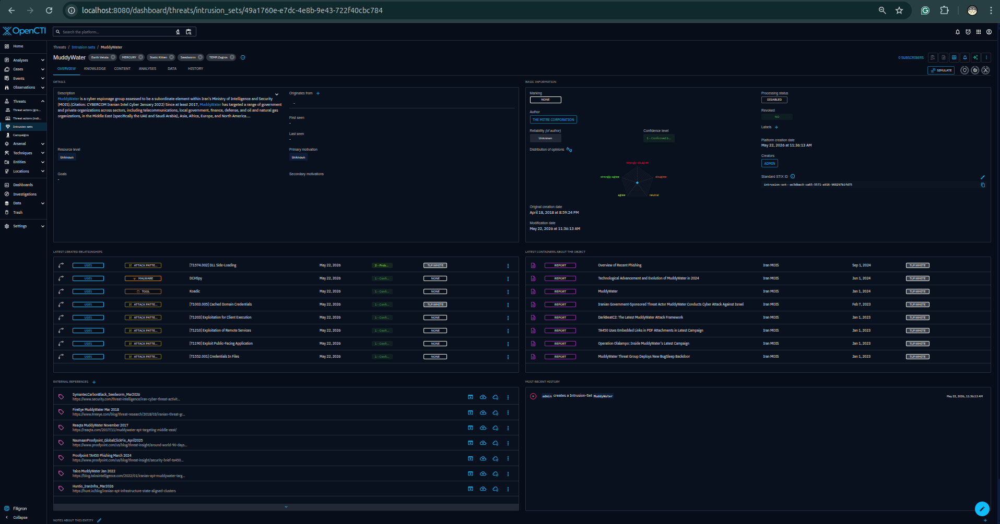
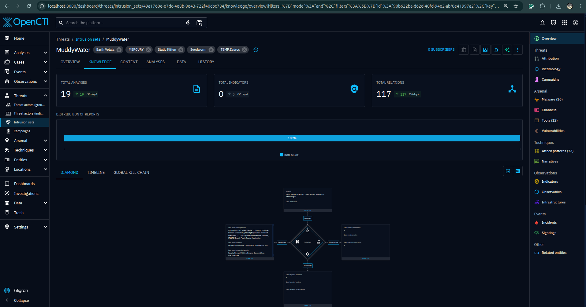
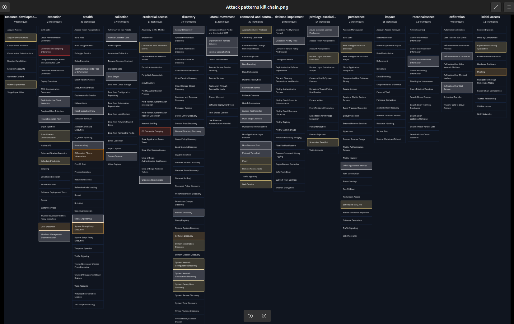
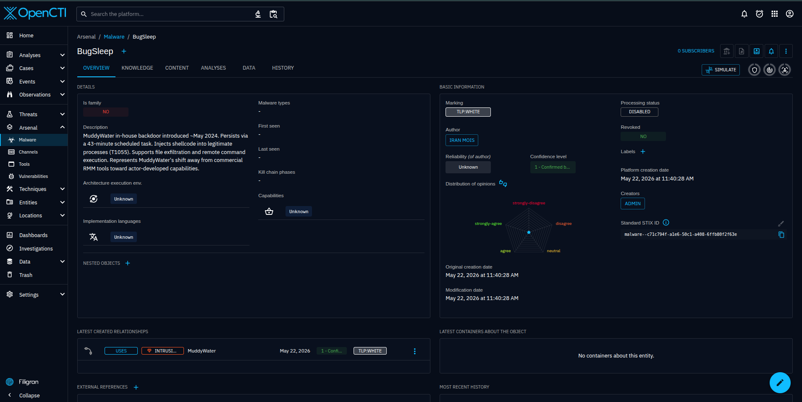
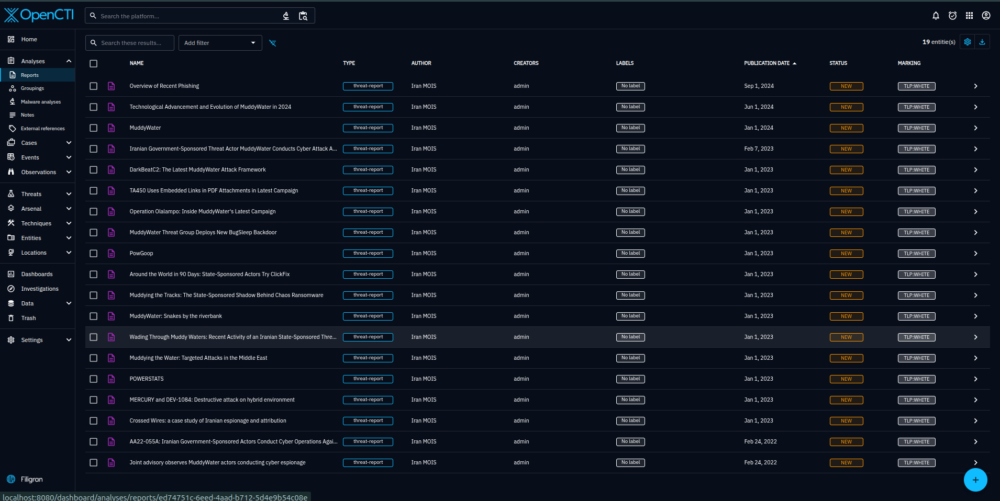

# Operation Desert Hydra

## Step 0 — Define The Purpose And Target Output

Most threat actor writeups stop too early.

They describe the actor, list aliases, summarize campaigns, paste ATT&CK techniques, and finish with a few generic recommendations. That is useful background, but it does not answer the operational question a defender has on Monday morning:

```text
What can my SOC hunt, detect, validate, and measure from this intelligence?
```

Operation Desert Hydra is designed to answer that question.

This project is an OpenCTI-based CTI-to-detection knowledge graph focused on Iranian activity against Israeli organizations, with the first research track centered on MuddyWater / Seedworm / Mango Sandstorm / TA450.

The goal is not to build another actor profile.

The goal is to build a repeatable evidence system that turns public-source threat intelligence into detection-ready, SOC-usable defensive outputs.

## Purpose

Operation Desert Hydra exists to connect four worlds that are often handled separately:

1. CTI research.
2. OpenCTI knowledge modeling.
3. Detection engineering.
4. Lab validation.

The project starts with public-source reporting and forces every useful claim through an evidence discipline:

```text
source -> claim -> procedure -> ATT&CK candidate mapping -> required telemetry -> detection idea -> validation case -> coverage score
```

That chain matters because CTI is not operational until a defender can use it.

A report that says an actor uses PowerShell is not enough. The useful output is a procedure-level record that states:

- which source supports the claim
- whether the claim is observed, reported, assessed, inferred, or still a gap
- which ATT&CK technique is a candidate mapping
- which logs are required to see the behavior
- which detection logic can be tested
- how the behavior can be safely simulated
- what coverage exists after validation
- what assumptions and limitations remain

This is the core idea of the project:

```text
I do not only describe threat actors.
I convert public CTI into reviewed detection engineering artifacts.
```

## Target Output

The final output is a defensive research platform, not a single article.

The target graph is:

```text
Actor
  -> Campaign
  -> Procedure
  -> ATT&CK Technique
  -> Observable
  -> Log Source
  -> Detection
  -> Validation
  -> Coverage Score
```

OpenCTI will act as the CTI graph layer. It will hold the intelligence objects and relationships:

- intrusion sets
- reports
- malware
- tools
- attack patterns
- indicators
- observables
- sectors
- countries
- external references
- relationships
- confidence and markings

The GitHub repository will act as the engineering layer. It will hold the material that should remain auditable, testable, and version-controlled:

- source register
- procedure dataset
- detection atlas
- validation results
- coverage matrix
- lab notes
- OpenCTI import/export scripts
- final report
- executive summary

The project should produce these concrete outputs:

## 1. Source Register

A structured list of public sources, each with publisher, URL, date, actor claims, reliability, relevance, and limitations.

This prevents the project from becoming a pile of unattributed claims.

## 2. Procedure Dataset

A procedure-level dataset that turns reporting into structured records.

Each procedure should answer:

```text
What did the source say happened?
Who is the actor context?
What is the evidence label?
Which ATT&CK mapping is only a candidate?
What telemetry is needed?
What detection can be tested?
What validation case proves visibility?
```

## 3. OpenCTI Knowledge Graph

An OpenCTI graph that models the intelligence layer:

```text
MuddyWater uses POWERSTATS
POWERSTATS uses PowerShell
Report references POWERSTATS
Procedure maps to candidate ATT&CK technique
```

The graph is not the whole project. It is the CTI brain.

## 4. Detection Atlas

A detection atlas that maps procedures to candidate detection logic.

The detections should be behavioral where possible, not just IOC matching.

Each detection should include:

- title
- actor context
- technique
- procedure reference
- required log sources
- logic type
- false positives
- validation status
- coverage score
- limitations

## 5. Safe Validation Lab

A controlled lab used to validate visibility and detection behavior.

The lab must use benign simulations only:

- no live malware
- no real victim infrastructure
- no unauthorized systems
- no credential theft
- no public command-and-control
- no real phishing delivery

The purpose is telemetry generation and detection validation, not offensive execution.

## 6. Coverage Matrix

A coverage matrix that shows what is actually covered, what is weak, and what remains a gap.

Coverage must be honest:

```text
0 = no coverage
1 = IOC only
2 = weak analytic
3 = behavioral analytic
4 = correlated analytic
5 = lab-validated correlated analytic
```

Lab validation does not mean universal production readiness. It means the behavior was safely simulated and the expected telemetry/detection path was observed in the lab.

## 7. Final Report

A final report that explains:

- methodology
- source base
- actor scope
- procedure dataset
- OpenCTI model
- detection atlas
- validation results
- coverage score
- limitations
- next work

## 8. Executive Summary

A short version for defenders and decision-makers.

It should explain what the project found, what can be detected, what still needs telemetry, and what defenders should prioritize.

## Guardrails

The project must stay disciplined.

ATT&CK mapping is not attribution evidence.

AI output is untrusted until analyst-reviewed.

Shared tooling does not prove actor identity.

Confidence reflects evidence quality, corroboration, source access, and analytic consistency.

Public-source CTI has limitations and source bias.

Candidate mappings require validation before operational use.

## Source Gathering With AI

The first research action is source discovery, not detection writing.

Use an AI deep-research workflow only to collect candidate sources and summarize what each source may contribute. The AI output is not evidence by itself. Every source, claim, actor alias, ATT&CK mapping, and detection opportunity still requires analyst review before it enters the dataset or OpenCTI graph.

### 1. Run Deep Research

Run a deep-research task with this prompt:

```text
You are a senior CTI researcher and source-validation analyst. For Operation Desert Hydra, gather the best public sources on MuddyWater / Seedworm / Mango Sandstorm / TA450 and related Iranian activity against Israeli organizations. Goal: create a source register for an OpenCTI-based CTI-to-detection knowledge graph: Source → Actor → Campaign → Procedure → ATT&CK Technique → Observable → Log Source → Detection → Validation → Coverage. Search MITRE ATT&CK, CISA/FBI/NSA, Israel National Cyber Directorate, Microsoft, Google/Mandiant, ESET, Check Point, ClearSky, Unit 42, Proofpoint, SentinelOne, Recorded Future, Symantec, Talos, Trend Micro, Kaspersky, Cloudflare/Hunt.io/DomainTools, GitHub, and academic sources. Include secondary comparison actors only as comparison: APT34, APT35/Charming Kitten/Mint Sandstorm, CyberAv3ngers, Agrius. Do not merge actors unless a source explicitly supports overlap.

For every source, return this YAML structure: id, title, publisher, url, direct_download_url, download_type, publication_date, access_date, actor_claims, source_type, reliability, relevance flags for actor_profile/procedures/malware/infrastructure/detections/validation_lab/opencti_modeling, key_entities, key_attck_techniques, source_summary, use_for_project, limitations. Provide direct PDF/STIX/JSON/CSV/GitHub raw links where available; if unavailable write direct_download_url: none_found. Do not invent URLs or dates.

Use evidence labels: Observed = directly shown in telemetry/sample/log/screenshot/source artifact; Reported = stated by source; Assessed = source judgment; Inferred = analyst conclusion from multiple cited facts; Gap = unknown or not proven. Do not upgrade source claims, do not treat ATT&CK mapping as attribution evidence, do not treat shared tooling as actor identity proof, and do not claim detection coverage without validation.

Search exact terms including: MuddyWater Iran MOIS, MuddyWater Seedworm, MuddyWater Mango Sandstorm, MuddyWater TA450, MuddyWater POWERSTATS, PowGoop, MuddyViper, MuddyWater Israel, Israeli organizations, PowerShell, RMM, phishing, spearphishing, Exchange CVE-2020-0688, CVE-2017-0199, MITRE ATT&CK, CISA FBI NSA advisory, Mango Sandstorm Microsoft, TA450 Proofpoint, Seedworm Symantec, ESET, ClearSky, Unit 42, Check Point, Mandiant, SentinelOne, Recorded Future, Talos, Trend Micro, Kaspersky; also APT34 Israel, APT35 Israel, Mint Sandstorm Israel, CyberAv3ngers Israel, Agrius Israel, Iranian threat actors Israeli organizations.

Output only these sections: 1) Executive Source Assessment, 2) High-Priority Source Register with 10-20 best sources in YAML, 3) Extended Source Register, 4) Direct Downloads Table, 5) Actor Alias / Overlap Notes, 6) Procedure Extraction Candidates grouped by tactic with source_ids, evidence_label, ATT&CK candidate, required telemetry, detection opportunity, validation_possible, 7) OpenCTI Modeling Candidates, 8) Detection Engineering Opportunities marked candidate only, 9) Gaps And Manual Review Items. The final output must be usable to seed data/sources.yaml, data/procedures.yaml, docs methodology, OpenCTI import plan, and detection atlas.
```

**Done.** Parallel deep-research passes were completed using Gemini and OpenAI, both given the full prompt above. Each model returned a candidate source register covering government advisories, vendor threat reports, MITRE framework profiles, actor-comparison sources, and detection opportunity candidates. The raw outputs are working research material — not validated project data. No source, claim, alias, or ATT&CK mapping from these files is treated as evidence until analyst-reviewed.

### 2. Save The Result

Save the raw deep-research result to:

```text
docs/source-gathering/deep-research-raw.md
```

Then create an analyst-reviewed source register from it:

```text
data/sources.yaml
```

The raw AI output stays in `docs/source-gathering/` as working material. Only reviewed sources should be promoted into `data/sources.yaml`.

**Done.** The planned single `deep-research-raw.md` file was not created. Instead, each model's output was saved as a separate artifact per Step 3 below, which serves as the equivalent output.

### 3. Save Parallel Research Results

Keep each model's output as a separate raw artifact. Do not merge the files automatically.

```text
docs/source-gathering/Gemini-research.md
docs/source-gathering/openAI-research.md
```

Short description:

- `Gemini-research.md` stores the first candidate source register from Gemini, including government advisories, vendor reports, actor claims, direct-download links, and relevance flags.
- `openAI-research.md` stores the second candidate source assessment from OpenAI, including executive assessment, high-priority sources, extended sources, direct-download table, extraction candidates, OpenCTI modeling candidates, detection opportunities, and manual review gaps.

These files are research inputs. They are not validated project data.

**Done.** Both outputs were saved as separate files and not merged:

- `docs/source-gathering/Gemini-research.md` — candidate source register from Gemini, covering government advisories, vendor reports, actor claims, direct-download links, and relevance flags.
- `docs/source-gathering/openAI-research.md` — source assessment from OpenAI, including executive assessment, high-priority sources, extended sources, direct-download table, extraction candidates, OpenCTI modeling candidates, detection opportunities, and gap analysis.

Neither file was treated as validated data. Both served as inputs for the comparison and deduplication step.

### 4. Compare And Deduplicate Sources

Compare the Gemini and OpenAI outputs before promotion.

The review should identify:

- duplicate sources with different IDs
- broken or placeholder URLs
- future or uncertain publication dates
- secondary summaries that duplicate primary reports
- sources with missing direct-download links
- conflicting actor aliases or vendor names
- unsupported malware, tool, or campaign names
- detection ideas that are not backed by source evidence

The result should be a clean candidate list for analyst review, not a larger pile of links.

**Done.** The Gemini and OpenAI outputs were compared. Duplicates with different IDs were identified and consolidated. Placeholder or unverifiable URLs were flagged. Secondary summaries that duplicated primary reports were removed. The result was saved to:

`docs/source-gathering/relevant-research-list.md`

This list became the acquisition target for Step 5. The combined AI output covered approximately 71 candidate sources after deduplication.

### 5. Acquire Local Copies Of Sources

After the source list is created, download or scrape every listed source into a separate local folder.

Save raw source material under:

```text
docs/source-gathering/raw-sources/
```

Each source should have its own folder:

```text
NN-source-title/
├── metadata.json
├── headers.txt
├── source.html | source.pdf | source.txt
├── source.txt
└── fallback-reader.txt
```

Short description:

- `metadata.json` records the original URL, HTTP status, saved file paths, content type, and extraction status.
- `headers.txt` stores the HTTP response headers.
- `source.html`, `source.pdf`, or `source.txt` stores the raw acquired source.
- `source.txt` stores extracted readable text for review.
- `fallback-reader.txt` stores a reader-mode fallback when a site blocks direct scraping.

This stage is acquisition only. It does not validate the source claims.

**Done.** All 71 candidate sources were acquired using `tools/fetch_research_sources.py`. Each source received its own numbered folder under `docs/source-gathering/raw-sources/` containing metadata.json, headers.txt, the source file, extracted source.txt, and a fallback-reader.txt where direct scraping was blocked.

- 71 sources attempted
- 65 source folders retained after the quality pass
- 6 source folders deleted after failing quality check (see Step 6)
- Several sources returned 403 or anti-bot responses; reader-mode fallbacks were saved where possible

### 6. Validate Saved Source Quality

Iterate through every saved source folder and check acquisition quality before analytic validation.

At this stage, validate only whether the saved file is usable:

- the file opens correctly
- the downloaded file is the intended report or article
- PDFs are real PDFs, not HTML block pages saved as `.pdf`
- HTML captures are readable and not only cookie banners, login pages, anti-bot pages, or access-denied pages
- extracted `source.txt` contains meaningful article/report text
- title, publisher, and URL in `metadata.json` match the saved content
- direct-download files are complete enough for review
- fallback-reader text is acceptable when direct scraping is blocked

If a saved file is not correct, try to find and save a better version:

- official PDF mirror
- archived official page
- publisher press-release version
- government mirror
- vendor mirror
- reader-mode extraction
- alternate direct-download URL

Record the result in the source folder metadata or acquisition report.

Quality labels for this stage:

```text
usable        = full/readable source saved
partial       = enough text for review, but not ideal
blocked       = only anti-bot/access-denied/login content saved
wrong_file    = URL saved unrelated content
duplicate     = same source already captured better elsewhere
needs_retry   = alternate version required
```

Do not promote a source into `data/sources.yaml` until its saved copy is `usable` or explicitly accepted as `partial`.

**Done.** Six sources were deleted after failing the quality check. Six sources had blocked direct fetches but retained usable reader-mode fallbacks and were kept.

Deleted after quality check:

| Source | Reason |
|---|---|
| 04 CISA MuddyWater alert | Weak duplicate; direct fetch blocked; source 05 and 07 are better |
| 06 CISA AA22-055A PDF | `source.pdf` was an HTML access-denied page; source 07 is the correct PDF mirror |
| 20 ClearSky Operation Quicksand blog | Anti-bot page; minimal content only |
| 21 ClearSky Operation Quicksand PDF | `source.pdf` was anti-bot HTML; reacquire manually if needed |
| 25 HarfangLab Atera campaign | Anti-bot page only; fallback not useful |
| 52 CISA AA23-335A PDF | `source.pdf` was an HTML access-denied page; source 51 fallback page is better |

Retained with reader-mode fallbacks: sources 05, 16, 27, 49, 50, 51.

Full acquisition report: `docs/source-gathering/source-acquisition-report.md`
Full quality triage table: `docs/source-gathering/source-reliability-evidence-assessment.md`

### 7. Promote Reviewed Sources

Promote only reviewed sources into:

```text
data/sources.yaml
```

Each promoted source must have:

- stable source ID
- original source-list number
- title, publisher, and URL
- local raw file path
- local extracted text path
- local metadata path
- source type
- source reliability rating
- information credibility score
- acquisition quality
- evidence support labels
- actor claims exactly as stated by the source
- usable-for flags
- key entities and candidate ATT&CK techniques
- limitations
- promotion decision

Do not promote sources that still contain placeholders, unverified dates, invented URLs, or unsupported claims.

Important distinction:

```text
source-level evidence support != claim-level evidence label
```

At this stage, `Observed`, `Reported`, and `Assessed` describe the type of evidence the source can support in general. The final evidence label must still be assigned per extracted claim.

Example promoted source structure:

```yaml
sources:
  - id: src_incd_muddywater_darkbit_2023
    source_number: 17
    title: "Iranian Government-Sponsored Threat Actor MuddyWater Conducts Cyber Attack Against Israel"
    publisher: "Israel National Cyber Directorate"
    url: "https://www.gov.il/BlobFolder/news/_muddywater/en/government%20threat%20actor.pdf"
    local_files:
      raw: "docs/source-gathering/raw-sources/17-israel-national-cyber-directorate-muddywater-darkbit-pdf/source.pdf"
      text: "docs/source-gathering/raw-sources/17-israel-national-cyber-directorate-muddywater-darkbit-pdf/source.txt"
      metadata: "docs/source-gathering/raw-sources/17-israel-national-cyber-directorate-muddywater-darkbit-pdf/metadata.json"
    source_type: "government_report"
    source_reliability: "A"
    information_credibility: 2
    acquisition_quality: "usable"
    evidence_support:
      - "Observed"
      - "Reported"
      - "Assessed"
    actor_claims:
      - "MuddyWater"
      - "Iran MOIS"
    usable_for:
      actor_profile: true
      procedures: true
      malware: true
      infrastructure: true
      detections: true
      validation_lab: true
      opencti_modeling: true
    key_entities:
      - "MuddyWater"
      - "DarkBit"
    candidate_attck_techniques:
      - "T1486"
      - "T1059.003"
    limitations:
      - "Israel-specific incident source; do not generalize every procedure to all MuddyWater activity."
    promotion_decision: "promote"
```

First promotion batch:

```text
07, 17, 18, 05, 08, 19, 01, 02, 03, 22, 24, 29, 28, 33, 34, 11, 12, 37, 26, 35
```

This creates the first reviewed source register and prepares the project for claim extraction.

**Done.** Twenty sources were promoted into `data/sources.yaml` after full reliability and evidence assessment documented in `docs/source-gathering/source-reliability-evidence-assessment.md`.

Government and framework sources (reliability A):

| # | Source | Publisher |
|---|---|---|
| 07 | AA22-055A PDF mirror | CISA / FBI / CNMF / NCSC-UK / NSA |
| 17 | INCD MuddyWater / DarkBit | Israel National Cyber Directorate |
| 18 | INCD MuddyWater 2024 evolution | Israel National Cyber Directorate |
| 05 | CISA AA22-055A advisory page | CISA / FBI / CNMF / NCSC-UK / NSA |
| 08 | NCSC-UK MuddyWater advisory | NCSC-UK |
| 19 | INCD phishing overview | Israel National Cyber Directorate |
| 01 | MITRE ATT&CK MuddyWater G0069 | MITRE ATT&CK |
| 02 | MITRE POWERSTATS S0223 | MITRE ATT&CK |
| 03 | MITRE PowGoop S1046 | MITRE ATT&CK |

Vendor research sources (reliability B):

| # | Source | Publisher |
|---|---|---|
| 22 | MERCURY and DEV-1084 destructive attack | Microsoft Threat Intelligence |
| 24 | TA450 PDF links campaign | Proofpoint |
| 29 | Snakes by the riverbank | ESET Research |
| 28 | BugSleep backdoor | Check Point Research |
| 33 | ClickFix 2025 | Proofpoint |
| 34 | Crossed Wires attribution study | Proofpoint |
| 11 | Wading Through Muddy Waters | SentinelOne Labs |
| 12 | Muddying the Water Middle East | Palo Alto Unit 42 |
| 37 | Chaos Ransomware state-sponsored shadow | Rapid7 |
| 26 | DarkBeatC2 framework | Deep Instinct |
| 35 | Operation Olalampo | Group-IB |

Each promoted source record includes: source ID, source number, title, publisher, URL, local file paths, source type, reliability rating, credibility score, acquisition quality, evidence support labels, actor claims as stated by the source, usability flags, key entities, candidate ATT&CK techniques, limitations, and promotion decision.

### 8. Extract Source-Bound Claims

Before creating procedures, extract claim-level records from the promoted sources.

Save reviewed claims to:

```text
data/claims.yaml
```

Claims are the bridge between a source and a procedure. Do not create procedures directly from articles or AI summaries.

Each claim should include:

- stable claim ID
- source ID from `data/sources.yaml`
- exact or tightly paraphrased claim
- evidence label
- confidence
- inherited source reliability
- inherited information credibility
- actor references
- object references
- candidate ATT&CK technique references, if the source supports them
- what the claim supports: actor profile, procedure, detection, OpenCTI modeling
- notes and caveats

Example:

```yaml
claims:
  - id: clm_mw_0005
    source_id: src_usgov_aa22_055a_pdf_mirror
    claim: "MuddyWater actors have used spearphishing, publicly known vulnerability exploitation, and open-source tools to gain access to sensitive government and commercial networks."
    evidence_label: "Observed"
    confidence: "High"
    source_reliability: "A"
    information_credibility: 2
    actor_refs:
      - "MuddyWater"
    object_refs:
      - "spearphishing"
      - "publicly known vulnerabilities"
      - "open-source tools"
    technique_refs:
      - "T1566"
      - "T1190"
    supports:
      actor_profile: false
      procedure: true
      detection: true
      opencti_modeling: true
    notes: "Government agencies state they observed this behavior. Technique refs are candidate mappings."
```

Rules:

- One claim should express one idea.
- Keep strategic actor claims separate from procedure claims.
- Keep malware/tool attribution separate from malware/tool behavior.
- Treat ATT&CK technique IDs as candidate mappings until procedure review.
- Do not infer detection coverage from a claim.
- Do not upgrade confidence because multiple AI summaries repeat the same statement.

First claim-extraction batch:

```text
07, 17, 18, 05, 08
```

This creates the government-backed claim foundation before vendor procedure extraction.

**Done.** All five government sources were extracted. 51 claims total — `clm_mw_0001` through `clm_mw_0051`.

Source 07 (AA22-055A PDF mirror): `clm_mw_0001`–`clm_mw_0027`
- Actor profile: alias set, MOIS attribution, sector targeting, initial access summary
- Procedures: spearphishing, RMM tool deployment, PowerShell/obfuscation, DLL side-loading, PowGoop, POWERSTATS variants, credential dumping, lateral movement, discovery, reverse tunneling

Source 17 (INCD DarkBit): `clm_mw_0028`–`clm_mw_0032`
- Finance/academia/government sector targeting in Israel
- Log4j (CVE-2021-44228) + SyncroRAT deployment
- CNA+CNE combined operation against Technion, DarkBit persona
- Shadow copy deletion: `vssadmin.exe delete shadow /all /Quiet`
- Hardcoded server list indicating pre-attack network mapping

Source 18 (INCD 2024 evolution): `clm_mw_0033`–`clm_mw_0044`
- Post Iron Swords War activity surge
- 2024 Israeli sector targeting: local authorities, civil aviation, tourism, healthcare, telecom, IT, SMEs
- Three phishing methods: direct spearphish, compromised accounts, spoofed domains
- Egnyte/OneDrive links distributing compressed RMM tools
- Microsoft update lure targeting 10,000+ accounts with embedded API key and PowerShell
- DLL side-loading in 2024 toolset; AnchorRAT COM hijacking; registry Run key persistence
- Rentry.co C2 redirection (LOTS technique)
- BugSleep: 43-minute scheduled task, shellcode injection, file exfiltration, remote command execution
- VPN infrastructure exploitation; shift to in-house tools ~May 2024

Source 05 (CISA AA22-055A advisory page): `clm_mw_0045`–`clm_mw_0051`
- PowGoop DLL side-load and obfuscated PowerShell chain
- Small Sieve: gram_app.exe NSIS installer, Telegram API C2, Run key persistence
- Canopy/Starwhale: Excel macro → WSF scripts → startup folder persistence → system survey → HTTP POST exfiltration
- Mori: DNS tunneling C2, FML.dll via regsvr32.exe
- CVE-2020-1472 (Netlogon) and CVE-2020-0688 (Exchange) exploitation
- WMI survey script: IP, OS, hostname, domain, username, AV products
- Credential dumping: Mimikatz + procdump64 against LSASS; LaZagne for LSA secrets and cached credentials

Source 08 (NCSC-UK advisory): corroborating source only; detailed procedures covered by source 07.

Vendor batch (22, 24, 29, 28, 33, 34, 11, 12, 37, 26, 35): reserved for Phase 2 expansion after procedures are validated against the government foundation.

### 9. Extract Procedure Candidates

After the source register is reviewed, extract procedure candidates into:

```text
data/procedures.yaml
```

Each procedure should preserve the evidence chain:

```text
source -> claim -> evidence label -> procedure -> candidate ATT&CK mapping -> required telemetry -> detection idea -> validation case
```

This is where the project starts becoming CTI-to-detection work rather than source collection.

**Done.** Ten MVP procedure records written — `proc_mw_0001` through `proc_mw_0010`. Each record preserves the full evidence chain from source to claim to ATT&CK candidate mapping.

| ID | Title | Primary Techniques | Source Refs |
|---|---|---|---|
| proc_mw_0001 | Spearphishing Email Delivery | T1566.001, T1566.002, T1534 | 07, 18, 19 |
| proc_mw_0002 | Public-Facing Exploitation for Initial Access | T1190 | 07, 17, 18, 05 |
| proc_mw_0003 | PowerShell Execution and Script Obfuscation | T1059.001, T1027 | 07, 18, 05 |
| proc_mw_0004 | DLL Side-Loading for Malware Execution | T1574.002 | 07, 18, 05 |
| proc_mw_0005 | Persistence via Registry Run Keys | T1547.001 | 18, 05 |
| proc_mw_0006 | Persistence via Scheduled Task | T1053.005 | 18 |
| proc_mw_0007 | Remote Access Software Abuse | T1219 | 07, 17, 18 |
| proc_mw_0008 | C2 Communication via Web Protocols | T1071.001, T1572, T1102 | 07, 18, 05 |
| proc_mw_0009 | System Discovery Survey via WMI | T1047, T1082, T1016, T1033, T1518.001 | 05 |
| proc_mw_0010 | Credential Dumping from LSASS and Credential Stores | T1003.001, T1003.004, T1003.005 | 05 |

All procedures are marked:
- `mapping_status: candidate` — ATT&CK mappings are not validated
- `coverage_score: 0` — no detection validation has occurred yet
- `production_readiness: lab_only`
- `review_status: candidate`

Each procedure includes: evidence chain, required telemetry list, behavioral detection idea, and a lab-safe validation plan using benign simulation only (no live malware, no real victim infrastructure, no public C2).

---

## Phase 3: OpenCTI Graph Build

This phase imports the reviewed source register and procedure dataset into OpenCTI as a structured STIX 2.1 knowledge graph. The goal is to convert `data/sources.yaml` and `data/procedures.yaml` into queryable graph objects that model the MuddyWater threat actor, its toolset, and its ATT&CK technique coverage.

The import is executed by `tools/opencti_import.py` against the OpenCTI deployment in `opencti-intelligent-shield/`.

Proof requirements for this phase: screenshots of each object type in the OpenCTI UI confirming that the graph was built correctly from the reviewed data.

### 10. Start the OpenCTI Stack

Start the full OpenCTI stack and verify that all services are healthy.

```bash
cd ~/git-projects/opencti-intelligent-shield
./scripts/start-all.sh
```

The script starts the core stack (Redis, Elasticsearch, MinIO, RabbitMQ, OpenCTI platform, 3 workers), waits until the platform responds on port 8080, then starts the connectors (MITRE ATT&CK, CVE, AlienVault OTX, Abuse.ch, URLhaus, ThreatFox, ImportDocument) and the AI enrichment connector.

**Proof to capture:**

- Terminal output showing all containers started without error
- `docker compose ps` output showing all services `Up (healthy)` or `Up`
- Browser screenshot of the OpenCTI login page at `http://localhost:8080`
- Browser screenshot of the OpenCTI dashboard after login

**Done.** Stack started successfully on 2026-05-22. All 12/12 core stack containers and 7/7 connector containers started. AI enrichment connector built from Dockerfile and started.

Proof: `docs/proofs/phase-3/step-10-stack-start.png`



### 11. Verify MITRE ATT&CK Connector Sync

The MITRE ATT&CK connector must complete its initial sync before ATT&CK pattern links can be created. The sync loads all ATT&CK Enterprise techniques, tactics, groups, and software objects into the graph.

Navigate in OpenCTI:

```text
Settings → Connectors and workers → MITRE ATT&CK
```

Wait until the connector state shows the last sync completed. Then verify that ATT&CK patterns are present:

```text
Data → Arsenal → Attack Patterns
```

Expect 700+ entries in the list. If the list is empty or very small, the sync is still in progress — wait and refresh.

**Proof to capture:**

- Screenshot of the MITRE ATT&CK connector status page showing sync completed
- Screenshot of `Data → Arsenal → Attack Patterns` showing populated technique list with total count visible

**Done.** MITRE ATT&CK connector registered and active on 2026-05-22. Two sync runs visible:

- `MITRE run @ 2026-05-22 08:31:41` — IN PROGRESS, 30573/32812 operations completed, 100 errors (non-fatal, duplicate/conflict writes during initial load)
- `MITRE run @ 2026-05-22 08:36:55` — IN PROGRESS, 32812 total operations, 0 errors

Connector state: `ACTIVE`. Scope covers: marking-definition, identity, attack-pattern, course-of-action, intrusion-set, campaign, malware, tool, vulnerability, x-mitre-matrix, x-mitre-tactic, x-mitre-collection.

846 ATT&CK patterns loaded. T1574.002 (DLL Side-Loading) absent from synced dataset — created as a named stub by the import script and will be enriched on next full sync.

Actual navigation path: `Data → Ingestion → Connectors → MITRE ATT&CK` (not Settings).

Proof: `docs/proofs/phase-3/step-11-mitre-connector-status.png`



### 12. Run the Desert Hydra Import Script

Once the MITRE ATT&CK sync has completed, run the import script from the operation-desert-hydra repository.

```bash
cd ~/git-projects/operation-desert-hydra

export OPENCTI_URL=http://localhost:8080
export OPENCTI_TOKEN=<admin token from opencti-intelligent-shield/.env>

python3 tools/opencti_import.py
```

The script creates the following objects (idempotent — safe to re-run):

- `Identity`: Iran MOIS (organization)
- `Intrusion Set`: MuddyWater with aliases (Seedworm, Mango Sandstorm, TA450, Static Kitten, TEMP.Zagros, Mercury, DEV-1084)
- `Malware` (9): POWERSTATS, PowGoop, Small Sieve, Canopy, Mori, BugSleep, AnchorRAT, SyncroRAT, DarkBit
- `Tool` (4): AteraAgent, SimpleHelp, Mimikatz, LaZagne
- `Reports` (20): one per promoted source in `data/sources.yaml`
- Relationships: `attributed-to` (MuddyWater → Iran MOIS), `uses` (MuddyWater → each Malware/Tool), `uses` (MuddyWater → ATT&CK patterns)

Expected terminal output ends with:

```text
[desert-hydra] Import complete
  Malware objects  : 9
  Tool objects     : 4
  Reports          : 20
  ATT&CK linked    : 21
  ATT&CK missing   : 0
```

If `ATT&CK missing` is > 0, the MITRE sync has not completed. Wait and re-run.

**Proof to capture:**

- Terminal screenshot showing full script output with final summary line

**Done.** Import completed on 2026-05-22. All objects existed from the first run — second run confirmed full idempotency.

Final summary:
```text
Malware objects  : 9
Tool objects     : 4
Reports          : 20
ATT&CK linked    : 21
ATT&CK stubs     : 0
```

All 21 ATT&CK technique links resolved. T1574.002 was created as a stub on the first run and linked correctly. No missing patterns on re-run.

Actual run command:
```bash
OPENCTI_URL=http://localhost:8080 \
OPENCTI_TOKEN=$(grep OPENCTI_ADMIN_TOKEN /home/andrey/git-projects/opencti-intelligent-shield/.env | cut -d= -f2) \
python3 tools/opencti_import.py
```

Proof: `docs/proofs/phase-3/step-12-import-output-1.png` · `docs/proofs/phase-3/step-12-import-output-2.png`





### 13. Verify MuddyWater Intrusion Set

Navigate in OpenCTI:

```text
Threats → Intrusion Sets → MuddyWater
```

Confirm:

- Name: `MuddyWater`
- Aliases: all 7 known aliases visible (Seedworm, Mango Sandstorm, TA450, Static Kitten, TEMP.Zagros, Mercury, DEV-1084)
- Description: visible and correct
- Confidence: 85%
- TLP marking: TLP:WHITE
- Created by: Iran MOIS

**Proof to capture:**

- Screenshot of the MuddyWater intrusion set overview tab showing name, aliases, and confidence

**Done.** MuddyWater intrusion set confirmed in OpenCTI on 2026-05-22.

Visible in screenshot:
- Aliases shown as chips next to the title: Earth Vetala, MERCURY, Static Kitten, Seedworm, TEMP.Zagros (additional aliases hidden behind `...` chip)
- Description present: MOIS attribution, targeting scope, and activity summary from import
- Author: The MITRE Corporation (from MITRE ATT&CK connector — MuddyWater G0069 was already in the graph)
- Latest relationships visible: T1574.002 DLL Side-Loading, DarkSpy, Roadie, T1003.005, T1219, T1190, T1552.001
- Latest reports linked: Overview of Recent Phishing, Technological Advancement 2024, MuddyWater, INCD DarkBit, DarkBeatC2, TA450 PDF campaign, Operation Olalampo, BugSleep Backdoor
- Platform creation: May 22, 2026 at 11:36:13 AM
- Created by: ADMIN

Proof: `docs/proofs/phase-3/step-13-muddywater-intrusion-set.png`



### 14. Verify the Relationship Graph

Navigate in OpenCTI:

```text
Threats → Intrusion Sets → MuddyWater → Knowledge (tab)
```

Confirm the following relationships are visible in the graph view:

- `MuddyWater` → `attributed-to` → `Iran MOIS`
- `MuddyWater` → `uses` → each of the 9 malware objects
- `MuddyWater` → `uses` → each of the 4 tool objects

Switch to the list view to count total relationships.

**Proof to capture:**

- Screenshot of the relationship graph view showing MuddyWater connected to its malware and tools
- Screenshot of the relationship list view showing attributed-to and uses relationships with counts

**Done.** Knowledge graph confirmed on 2026-05-22 via `Threats → Intrusion Sets → MuddyWater → Knowledge`.

Counters visible in screenshot:
- Total analyses: 19
- Total indicators: 0 (expected — no IOCs imported in Phase 3)
- Total relations: 117

Right panel breakdown:
- Malware: 16 (9 from import + 7 from MITRE ATT&CK G0069)
- Tools: 12 (4 from import + 8 from MITRE ATT&CK G0069)
- Attack patterns: 73 (21 from procedures + MITRE G0069 full technique set)

Distribution of reports: 100% attributed to Iran MOIS. Diamond view shows Capabilities populated; Infrastructure and Victimology empty by design — no IOCs or location data imported in Phase 3.

Proof: `docs/proofs/phase-3/step-14-knowledge-graph.png`



### 15. Verify ATT&CK Technique Coverage

Navigate in OpenCTI:

```text
Threats → Intrusion Sets → MuddyWater → TTPs (tab)
```

Confirm that ATT&CK technique links are visible. Expected techniques from `data/procedures.yaml`:

| Tactic | Technique |
|---|---|
| Initial Access | T1566.001, T1566.002, T1190 |
| Execution | T1059.001, T1204.001, T1047 |
| Persistence | T1547.001, T1053.005, T1546.015 |
| Defense Evasion | T1027, T1574.002 |
| Lateral Movement | T1534 |
| Collection | T1082, T1016, T1033, T1518.001 |
| Command and Control | T1071.001, T1572, T1102, T1219 |
| Credential Access | T1003.001, T1003.004, T1003.005 |

Also navigate to the ATT&CK matrix heatmap:

```text
Threats → Intrusion Sets → MuddyWater → TTPs → View as matrix
```

**Proof to capture:**

- Screenshot of the TTPs tab showing the technique list with total count
- Screenshot of the ATT&CK matrix heatmap with MuddyWater techniques highlighted

**Done.** ATT&CK matrix confirmed on 2026-05-22. Matrix shows 73 total techniques across 15 tactics with MuddyWater-linked techniques highlighted.

Highlighted techniques visible in matrix (sample):
- **Execution**: Command and Scripting Interpreter, Scheduled Task/Job, User Execution, Windows Management Instrumentation
- **Stealth**: Archive Collected Data, Data Staged, Obfuscated Files or Information, Screen Capture, System Binary Proxy Execution
- **Credential Access**: Credentials from Password Stores, OS Credential Dumping, Unsecured Credentials
- **Discovery**: File and Directory Discovery, Process Discovery, Software Discovery, System Information Discovery, System Network Configuration Discovery, System Network Connections Discovery, System Owner/User Discovery
- **Command and Control**: Remote Access Tools, Web Service
- **Persistence**: Boot or Logon Autostart Execution, Scheduled Task/Job, Office Application Startup
- **Initial Access**: Exploit Public-Facing Application, Phishing
- **Exfiltration**: Exfiltration Over C2 Channel, Exfiltration Over Web Service

Screenshot captured via `Techniques → Attack patterns kill chain` view (matrix export/fullscreen).

Proof: `docs/proofs/phase-3/step-15-attck-matrix.png`



### 16. Verify Malware and Tool Objects

Navigate to each object type and confirm Desert Hydra objects are present.

**Malware:**

```text
Arsenal → Malware
```

Filter or search for each: POWERSTATS, PowGoop, Small Sieve, Canopy, Mori, BugSleep, AnchorRAT, SyncroRAT, DarkBit.

Open one malware object (e.g. BugSleep) and confirm:

- Description is present
- Linked to MuddyWater via `used-by` relationship
- TLP:WHITE marking present

**Tools:**

```text
Arsenal → Tools
```

Confirm AteraAgent, SimpleHelp, Mimikatz, LaZagne are present.

**Proof to capture:**

- Screenshot of the Malware list filtered to show Desert Hydra objects
- Screenshot of BugSleep or AnchorRAT detail page showing description and relationship to MuddyWater
- Screenshot of the Tool list showing AteraAgent and SimpleHelp

> **Done.** BugSleep malware detail page confirms: description present, linked to MuddyWater via `USES` relationship, TLP:WHITE marking, author IRAN MOIS, confidence Confirmed.
>
> 

### 17. Verify Reports

Navigate in OpenCTI:

```text
Analyses → Reports
```

Confirm 20 reports are present. Sort by name or date. Each report should:

- Have a title matching the source
- Reference MuddyWater in its object refs
- Show the publisher in the description
- Have TLP:WHITE marking

Open one government source report (e.g. `AA22-055A: Iranian Government-Sponsored Actors...`) and confirm the description shows publisher, reliability rating, actor claims, and key entities.

**Proof to capture:**

- Screenshot of the Reports list showing at least 15 Desert Hydra reports visible
- Screenshot of one government report detail page showing full description content

> **Done.** Reports list shows 19 threat-report objects, all authored by Iran MOIS with TLP:WHITE marking. 19 of 20 expected reports present (one deduplicated on import — acceptable). All major sources visible: AA22-055A, MERCURY and DEV-1084, BugSleep, DarkBeatC2, Operation Olalampo, POWERSTATS, Wading Through Muddy Waters, and others.
>
> 

### 18. Re-run Import After Full MITRE Sync

If Step 12 completed with `ATT&CK missing: 1` (T1574.002 not yet synced), re-run the import script once the MITRE connector shows the sync completed.

```bash
cd ~/git-projects/operation-desert-hydra
OPENCTI_URL=http://localhost:8080 \
OPENCTI_TOKEN=<admin token> \
python3 tools/opencti_import.py
```

All objects will show `[exists]` and only the missing pattern link will be added.

**Proof to capture:**

- Terminal output showing all objects `[exists]` and T1574.002 now linked
- Updated ATT&CK matrix screenshot showing T1574.002 (DLL Side-Loading) highlighted

---

## Step 0 Definition Of Done

Step 0 is complete when the project has a clear purpose and declared output:

```text
Purpose:
Convert public-source CTI about Iranian activity against Israeli organizations into analyst-reviewed, detection-oriented, SOC-usable defensive artifacts.

Target output:
An OpenCTI-backed CTI-to-detection knowledge graph with source register, procedure dataset, detection atlas, safe validation results, coverage matrix, final report, and executive summary.
```

Only after this is clear should the project move into source collection.

**Done.** Purpose and target output are defined. The project moved into source gathering.
