# Operation Desert Hydra — AI-Assisted CTI Pipeline: MuddyWater to Kibana

*11 validated detections from public sources, OpenCTI graph, and a one-command lab*


---

## Table of Contents

1. [Why MuddyWater?](#why-muddywater)
2. [The Pipeline](#the-pipeline)
3. [Phase 1: Source Gathering](#phase-1-source-gathering)
4. [Phase 2: Procedure Dataset](#phase-2-procedure-dataset)
5. [Phase 3: OpenCTI Knowledge Graph](#phase-3-opencti-knowledge-graph)
6. [Phase 4: Detection Atlas](#phase-4-detection-atlas)
7. [Phase 5: Validation Lab](#phase-5-validation-lab)
   - [Step 21 — Spearphishing Delivery Chain](#step-21-det_mw_0001--spearphishing-delivery-chain)
   - [Step 22 — Web Service Shell Spawn](#step-22-det_mw_0002--web-service-shell-spawn)
   - [Step 23 — PowerShell Encoded Command](#step-23-det_mw_0003--powershell-encoded-command)
   - [Step 24 — DLL Side-Loading](#step-24-det_mw_0004--dll-side-loading)
   - [Step 25 — Registry Run Key Persistence](#step-25-det_mw_0005--registry-run-key-persistence)
   - [Step 26 — Scheduled Task (43-Minute Beacon)](#step-26-det_mw_0006--scheduled-task-43-minute-beacon)
   - [Step 27 — RMM Tool Abuse](#step-27-det_mw_0007--rmm-tool-abuse)
   - [Step 28 — Telegram Bot API C2](#step-28-det_mw_0008a--telegram-bot-api-c2)
   - [Step 29 — DNS Tunneling](#step-29-det_mw_0008b--dns-tunneling)
   - [Step 30 — WMI SecurityCenter2 Discovery](#step-30-det_mw_0009--wmi-securitycenter2-discovery)
   - [Step 31 — LSASS Memory Access](#step-31-det_mw_0010--lsass-memory-access)
8. [Validation Results Summary](#phase-5-validation-results-summary)
9. [Phase 6: Coverage Matrix](#phase-6-coverage-matrix)
10. [What Defenders Should Do Right Now](#what-defenders-should-do-right-now)
11. [Reproduce It Yourself](#reproduce-it-yourself)
12. [Next Steps](#next-steps)

---

Most threat actor writeups stop too early. They describe the group, list ATT&CK techniques, and paste some IoCs. Then the report sits in a folder while defenders wonder: *what do I actually do with this on Monday?*

Operation Desert Hydra is an answer to that question.

This article documents a full CTI-to-detection pipeline focused on **MuddyWater** — an Iranian state-linked actor (MOIS) that has been targeting Israeli government, defense, and critical infrastructure organizations since at least 2019. By the end, you'll have 11 detection records, 12 Kibana proof screenshots, and a working lab you can deploy with a single command.

Everything is on GitHub: [github.com/anpa1200/operation-desert-hydra](https://github.com/anpa1200/operation-desert-hydra)

---

## Why MuddyWater?

Three reasons:

1. **Rich public reporting.** CISA, Israel's INCD, ClearSky, Deep Instinct, Mandiant, and Proofpoint have all published detailed technical analysis. This gives enough procedure-level specificity to engineer real detections.

2. **Consistent playbook.** Across five years of reporting, the same pattern recurs: spearphishing → scripting engine → encoded PowerShell → RMM tool. The consistency makes it detectable.

3. **Relevant geography.** The actor consistently targets Israeli organizations — a geography with high analytical value and underserved public detection coverage.

---

## The Pipeline

The project enforces a chain from source to Kibana screenshot:

```
source → claim → procedure → ATT&CK mapping → telemetry requirement
  → detection pseudologic → benign simulation → lab result → coverage score
```

No step is skipped. Every claim has a source. Every detection has a validation case. Every PASS has a screenshot.

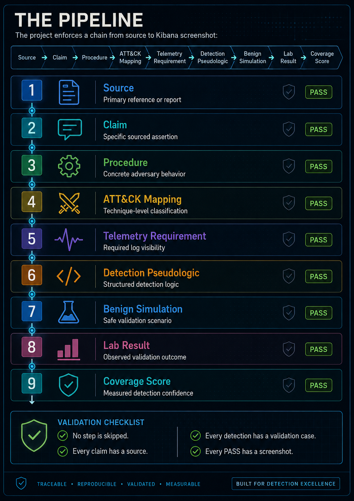

---

## Phase 1: Source Gathering

The first step is source discovery, not detection writing.

### Traditional Source Gathering — and Why It's Not Enough Alone

The standard workflow for CTI source gathering looks like this: run keyword searches (Google, Google Dorks, site: operators for known vendor blogs), check your Threat Intelligence Platform for existing reports on the actor, subscribe to vendor RSS feeds, pull ISAC/ISAO advisories, and query your organization's TIP for any existing indicator sets or finished intelligence reports tagged to the actor.

For a mature, well-documented actor like MuddyWater this gets you to maybe 15–20 well-known sources quickly — the CISA advisory, the MITRE ATT&CK page, two or three vendor blog posts you already knew about. The problem is coverage holes: you'll reliably find sources that are already in your network's vocabulary and miss the ones that aren't. A CERT-IL PDF published in Hebrew and linked only from a government portal, a Group-IB campaign teardown behind a partial paywall, or a 2020 ClearSky report that predates your current TIP subscription window — all of these can fall out of a manual search pass.

TIPs compound this in a specific way: they surface what has already been ingested and tagged. If a source was never promoted into your TIP (because it was published before the subscription started, or because no analyst had time to import it), it is invisible inside the platform. The TIP is authoritative for what it knows, not for the universe of available sources.

The parallel AI research pass was not a replacement for traditional gathering — it was a coverage supplement. After both approaches ran, the traditional pass and the AI outputs were merged into the same deduplication step. The AI outputs added approximately 40 sources beyond what a manual search surfaced; traditional search added discipline about sources the models hallucinated (fabricated URLs, mis-attributed PDFs). Neither was sufficient alone.

I ran parallel deep-research passes using Gemini and OpenAI, both given the same prompt. Each returned a candidate source register. Both outputs were compared, deduplicated (71 candidates → 8 promoted), and the surviving sources were manually acquired and reviewed before anything entered the dataset.

### The Actual Prompt

This is the exact prompt used — both models received it verbatim:

```
You are a senior CTI researcher and source-validation analyst. For Operation Desert Hydra,
gather the best public sources on MuddyWater / Seedworm / Mango Sandstorm / TA450 and
related Iranian activity against Israeli organizations. Goal: create a source register for
an OpenCTI-based CTI-to-detection knowledge graph:
Source → Actor → Campaign → Procedure → ATT&CK Technique → Observable → Log Source
→ Detection → Validation → Coverage.

Search MITRE ATT&CK, CISA/FBI/NSA, Israel National Cyber Directorate, Microsoft,
Google/Mandiant, ESET, Check Point, ClearSky, Unit 42, Proofpoint, SentinelOne,
Recorded Future, Symantec, Talos, Trend Micro, Kaspersky, Cloudflare/Hunt.io/DomainTools,
GitHub, and academic sources.

Include secondary comparison actors only as comparison: APT34, APT35/Charming Kitten/Mint
Sandstorm, CyberAv3ngers, Agrius. Do not merge actors unless a source explicitly supports
overlap.

For every source, return this YAML structure:
  id, title, publisher, url, direct_download_url, download_type, publication_date,
  access_date, actor_claims, source_type, reliability, relevance flags for
  actor_profile/procedures/malware/infrastructure/detections/validation_lab/opencti_modeling,
  key_entities, key_attck_techniques, source_summary, use_for_project, limitations.

Provide direct PDF/STIX/JSON/CSV/GitHub raw links where available; if unavailable write
direct_download_url: none_found. Do not invent URLs or dates.

Use evidence labels:
  Observed = directly shown in telemetry/sample/log/screenshot/source artifact
  Reported = stated by source
  Assessed = source judgment
  Inferred = analyst conclusion from multiple cited facts
  Gap = unknown or not proven

Do not upgrade source claims, do not treat ATT&CK mapping as attribution evidence, do not
treat shared tooling as actor identity proof, and do not claim detection coverage without
validation.

Search exact terms including:
  MuddyWater Iran MOIS, MuddyWater Seedworm, MuddyWater Mango Sandstorm,
  MuddyWater TA450, MuddyWater POWERSTATS, PowGoop, MuddyViper, MuddyWater Israel,
  Israeli organizations, PowerShell, RMM, phishing, spearphishing, Exchange CVE-2020-0688,
  CVE-2017-0199, MITRE ATT&CK, CISA FBI NSA advisory, Mango Sandstorm Microsoft,
  TA450 Proofpoint, Seedworm Symantec, ESET, ClearSky, Unit 42, Check Point, Mandiant,
  SentinelOne, Recorded Future, Talos, Trend Micro, Kaspersky;
  also: APT34 Israel, APT35 Israel, Mint Sandstorm Israel, CyberAv3ngers Israel,
  Agrius Israel, Iranian threat actors Israeli organizations.

Output only these sections:
  1) Executive Source Assessment
  2) High-Priority Source Register with 10-20 best sources in YAML
  3) Extended Source Register
  4) Direct Downloads Table
  5) Actor Alias / Overlap Notes
  6) Procedure Extraction Candidates grouped by tactic with source_ids, evidence_label,
     ATT&CK candidate, required telemetry, detection opportunity, validation_possible
  7) OpenCTI Modeling Candidates
  8) Detection Engineering Opportunities marked candidate only
  9) Gaps And Manual Review Items

The final output must be usable to seed data/sources.yaml, data/procedures.yaml,
docs methodology, OpenCTI import plan, and detection atlas.
```

### What the Prompt Is Designed to Do

A few decisions worth explaining:

**Output schema in the prompt.** Asking for a specific YAML field list (`id`, `title`, `publisher`, `url`, `direct_download_url`…) forces the model to either produce usable data or leave a visible blank — no vague summaries. `direct_download_url: none_found` is the required answer when a URL doesn't exist, which prevents the model from inventing one.

**Evidence labels baked in.** The five labels (Observed / Reported / Assessed / Inferred / Gap) are defined in the prompt so the model applies them consistently and the output is ready to feed directly into `data/procedures.yaml` without reformatting.

**Explicit anti-hallucination rules.** "Do not invent URLs or dates." "Do not upgrade source claims." "Do not treat ATT&CK mapping as attribution evidence." These are not just principles — they are instructions the model can fail visibly on, which makes QA faster.

**Parallel models, same prompt.** Running Gemini and OpenAI on the same prompt and comparing outputs catches source fabrications: if one model lists a URL the other doesn't, that URL gets verified before it enters the register. Two models that agree independently on a source add confidence; one model alone that lists something unusual is a flag.

### The Review Gate

Every source that came out of the AI output went through this checklist before being promoted into `data/sources.yaml`:

- Is the URL real and accessible?
- Is the publication date accurate?
- Does the content actually describe MuddyWater procedures (not just mention the name)?
- Is there at least one procedure-level claim (not just "actor uses PowerShell")?
- Is the actor identification explicit or inferred from shared tooling only?

71 candidates → 8 government/vendor sources promoted. The rest were duplicates, secondary summaries, or sources that named the actor without procedure-level specificity.

### Research Artifacts (All in the Repo)

Every file from the source gathering workflow is version-controlled and publicly accessible:

- **[Gemini-research.md](https://github.com/anpa1200/operation-desert-hydra/blob/main/docs/source-gathering/Gemini-research.md)** — Raw Gemini deep-research output: candidate source register in YAML, procedure extraction candidates, OpenCTI modeling candidates, detection opportunities, gaps.
- **[openAI-research.md](https://github.com/anpa1200/operation-desert-hydra/blob/main/docs/source-gathering/openAI-research.md)** — Raw OpenAI deep-research output: executive assessment, high-priority sources, extended source register, direct download list, actor alias notes.
- **[relevant-research-list.md](https://github.com/anpa1200/operation-desert-hydra/blob/main/docs/source-gathering/relevant-research-list.md)** — Deduplicated candidate list after comparing both model outputs: 71 sources, acquisition targets for Step 5.
- **[source-acquisition-report.md](https://github.com/anpa1200/operation-desert-hydra/blob/main/docs/source-gathering/source-acquisition-report.md)** — Results of the automated fetch run: HTTP status, content type, file size, and extraction status for all 71 sources.
- **[source-reliability-evidence-assessment.md](https://github.com/anpa1200/operation-desert-hydra/blob/main/docs/source-gathering/source-reliability-evidence-assessment.md)** — Analyst review notes: reliability ratings, evidence quality, promotion decisions, and limitations per source.
- **[raw-sources/](https://github.com/anpa1200/operation-desert-hydra/tree/main/docs/source-gathering/raw-sources)** — 71 numbered source folders, each containing `metadata.json`, `headers.txt`, the raw source file, extracted `source.txt`, and fallback reader output.

**Promoted sources (highest weight):**

- **CISA AA22-055A (Feb 2022)** — Full procedure survey: PowGoop, POWERSTATS, Small Sieve, Mori, Canopy, Marlin; WMI survey script; credential dumping tools.
- **INCD 2023** — Israeli campaign specifics: ScreenConnect/SimpleHelp RMM abuse, Egnyte/OneDrive lures, Log4j + Exchange exploitation.
- **INCD 2024** — BugSleep analysis: 43-minute scheduled task beacon, VPN exploitation, new RMM tools (Level, PDQConnect).

Supporting vendor sources: ClearSky, Deep Instinct, Group-IB, Mandiant, Proofpoint, Sekoia.io, Symantec.

### Why These Three Have the Highest Weight

The reliability assessment used a two-axis rubric: **Source Reliability (A–F)** separating publication discipline from content, and **Information Credibility (1–6)** rating how well each claim is grounded.

**CISA AA22-055A — Reliability A, Credibility 2**

This is a joint advisory signed by five national authorities: CISA, FBI, CNMF, NCSC-UK, and NSA. That multi-agency co-signature is not ceremonial — each agency must independently agree to the technical content before it publishes. The advisory names specific malware families (PowGoop, POWERSTATS, Small Sieve, Mori, Canopy, Marlin), includes an actual WMI PowerShell survey script attributed to MuddyWater, and lists credential-dumping tool names. Evidence label: `Reported` / `Assessed`. The PDF acquired locally at `raw-sources/07-u-s-cyber-command-defense-media-aa22-055a-pdf-mirror/source.pdf` is the authoritative copy distributed via Defense Media Activity. Credibility is 2, not 1, because the advisory states TTPs based on intelligence assessment rather than a single intercepted artifact — but the authority behind that assessment is as high as public-source CTI gets.

**INCD 2023 (MuddyWater / DarkBit PDF) — Reliability A, Credibility 2**

The Israel National Cyber Directorate is the government authority responsible for civilian cyber defense in Israel, the primary target country for this actor. This report covers a specific Israeli campaign including: tool names (ScreenConnect, SimpleHelp), file-sharing lure services (Egnyte, OneDrive), exploitation of Log4j and Exchange CVE-2020-0688, and deployment of ransomware (DarkBit) as a cover operation. Evidence label: `Observed` / `Reported` / `Assessed`. The "Observed" label means the INCD had direct visibility into the incident — not a secondary summary. This gives procedure-level specificity that generic vendor threat intel doesn't reach. Acquired at `raw-sources/17-israel-national-cyber-directorate-muddywater-darkbit-pdf/source.pdf`.

**INCD 2024 (BugSleep PDF) — Reliability A, Credibility 2**

Same publisher authority as INCD 2023, focused on MuddyWater's 2024 evolution. Key content: BugSleep backdoor analysis, the specific 43-minute scheduled task beacon interval (which became `proc_mw_0006` and `det_mw_0006`), VPN exploitation, and new RMM tools (Level, PDQConnect). The 43-minute interval is a concrete behavioral fingerprint — not a general TTP category — and it came from direct INCD analysis. Evidence label: `Observed` / `Reported` / `Assessed`. Acquired at `raw-sources/18-israel-national-cyber-directorate-technological-advancement-and-evolution-of-muddywater-in/source.pdf`.

The three sources share a common characteristic: they are not secondary aggregators or vendor marketing. They are government authorities with direct incident visibility reporting on specific Israeli campaigns.

### Steps After Deduplication: What Actually Happened to All 71 Sources

After the AI outputs were merged and deduplicated, 71 candidate sources remained. Here is what happened to them across Steps 5–9:

**Step 5 — Automated Acquisition**

`tools/fetch_research_sources.py` ran against all 71 URLs. For each source it created a numbered folder under `docs/source-gathering/raw-sources/` with:

```
raw-sources/
  01-mitre-att-ck-muddywater-g0069/
    metadata.json        # URL, fetch timestamp, HTTP status, content-type, size
    headers.txt          # Raw HTTP response headers
    source.html / source.pdf / source.txt   # Primary file
    source.txt           # Text extract (for PDFs and HTML)
    fallback-reader.txt  # Reader-mode fallback if primary was blocked or JS-rendered
```

Not all fetches succeeded. Some sources returned 403 (vendor gating), some required JS rendering (only fallback text was captured), and two PDFs were corrupted. The acquisition report at `docs/source-gathering/source-acquisition-report.md` records the HTTP status, file size, and extraction status for all 71.

**Step 6 — Reliability and Credibility Rating**

Each acquired source was rated using the two-axis rubric. The full assessment table is in `docs/source-gathering/source-reliability-evidence-assessment.md`. Outcome breakdown:

- Reliability A (government / primary standard): 23 sources
- Reliability B (usually reliable vendor / research publisher): 25 sources
- Reliability C (secondary / news / marketing): 18 sources
- Reliability F (failed acquisition or cannot judge): 5 sources

**Step 7 — Promotion Decision**

Only sources with a combination of Reliability A or B, Credibility 2 or better, a usable acquisition, and at least one procedure-level claim were promoted into `data/sources.yaml`. The rest were assigned one of: `Use as corroboration`, `Use as comparison only`, `Defer`, or `Exclude`.

71 candidates → 8 primary sources promoted into the dataset. The 63 that were not promoted are retained in `raw-sources/` for future work; they are not discarded.

**Step 8 — Claim Extraction**

For each promoted source, specific claims were extracted with source binding and evidence labels. A claim is not "MuddyWater uses PowerShell" — it is: "CISA AA22-055A (AA22-055A PDF, p.4) reports that MuddyWater actors deploy PowGoop, a DLL loader that decrypts and executes a PowerShell backdoor (`Reported`)." This source-bound format prevents claim drift downstream.

**Step 9 — Procedure Candidate Extraction**

From the bound claims, 10 procedure candidates were grouped by tactic: Initial Access, Execution, Persistence, Defense Evasion, Discovery, C2, Credential Access. Each candidate recorded: required telemetry, detection opportunity, whether lab validation was feasible, and whether the procedure appeared in multiple independent sources (a promotion signal for higher confidence scores later).

### The Full 71-Source Candidate List

This is the deduplicated list produced after comparing Gemini and OpenAI outputs. Every source here was an acquisition target for Step 5.

**Core MuddyWater / Seedworm / TA450 / Mango Sandstorm**

1. [MITRE ATT&CK — MuddyWater G0069](https://attack.mitre.org/groups/G0069/)
2. [MITRE ATT&CK — POWERSTATS S0223](https://attack.mitre.org/software/S0223/)
3. [MITRE ATT&CK — PowGoop S1046](https://attack.mitre.org/software/S1046/)
4. [CISA alert — Iranian Government-Sponsored MuddyWater Actors Conducting Malicious Cyber Operations](https://www.cisa.gov/news-events/alerts/2022/02/24/iranian-government-sponsored-muddywater-actors-conducting-malicious)
5. [CISA / FBI / CNMF / NCSC-UK / NSA — AA22-055A advisory page](https://www.cisa.gov/news-events/cybersecurity-advisories/aa22-055a)
6. [CISA / FBI / CNMF / NCSC-UK / NSA — AA22-055A PDF](https://www.cisa.gov/sites/default/files/publications/AA22-055A_Iranian_Government-Sponsored_Actors_Conduct_Cyber_Operations.pdf)
7. [U.S. Cyber Command / Defense media — AA22-055A PDF mirror](https://media.defense.gov/2022/Feb/24/2002944274/-1/-1/0/CSA_AA22-055A_Iranian_Government-Sponsored_Actors_Conduct_Cyber_Operations.PDF)
8. [NCSC-UK — Joint advisory on MuddyWater actor](https://www.ncsc.gov.uk/news/joint-advisory-observes-muddywater-actors-conducting-cyber-espionage)
9. [U.S. Cyber Command / Iran Watch mirror — Iranian intel cyber suite of malware PDF](https://www.iranwatch.org/sites/default/files/cybercom_muddywater_press_release.pdf)
10. [Decipher — US Cyber Command Discloses MuddyWater Malware Samples](https://duo.com/decipher/us-cyber-command-discloses-muddywater-malware-samples)
11. [SentinelOne — Wading Through Muddy Waters](https://www.sentinelone.com/labs/wading-through-muddy-waters-recent-activity-of-an-iranian-state-sponsored-threat-actor/)
12. [Palo Alto Unit 42 — Muddying the Water: Targeted Attacks in the Middle East](https://unit42.paloaltonetworks.com/unit42-muddying-the-water-targeted-attacks-in-the-middle-east/)
13. [CERTFA Radar — MuddyWater Threat Actor Cluster](https://radar.certfa.com/en/insights/cluster/fe272810/)
14. [CERTFA Radar — MuddyWater / Earth Vetala Intrusion](https://radar.certfa.com/en/threats/view/d7c9c420/)
15. [Group-IB — MuddyWater APT Group Profile](https://www.group-ib.com/masked-actors/muddywater/)

**Israel-Focused MuddyWater Sources**

16. [Israel National Cyber Directorate — MuddyWater page](https://www.gov.il/en/pages/_muddywater)
17. [Israel National Cyber Directorate — MuddyWater / DarkBit PDF](https://www.gov.il/BlobFolder/news/_muddywater/en/government%20threat%20actor.pdf)
18. [Israel National Cyber Directorate — Technological Advancement and Evolution of MuddyWater in 2024 PDF](https://www.gov.il/BlobFolder/reports/maddy_water_2024/en/ALERT_CERT_IL_W_1858.pdf)
19. [Israel National Cyber Directorate — Overview of Recent Phishing PDF](https://www.gov.il/BlobFolder/reports/alert_1947/he/ALERT-CERT-IL-W-1947.pdf)
20. [ClearSky — Operation Quicksand: MuddyWater's Offensive Attack Against Israeli Organizations](https://www.clearskysec.com/operation-quicksand/)
21. [ClearSky — Operation Quicksand PDF](https://www.clearskysec.com/wp-content/uploads/2020/10/Operation-Quicksand.pdf)
22. [Microsoft — MERCURY and DEV-1084: Destructive attack on hybrid environment](https://www.microsoft.com/en-us/security/blog/2023/04/07/mercury-and-dev-1084-destructive-attack-on-hybrid-environment/)
23. [Microsoft — Exposing POLONIUM activity and infrastructure targeting Israeli organizations](https://www.microsoft.com/en-us/security/blog/2022/06/02/exposing-polonium-activity-and-infrastructure-targeting-israeli-organizations/)
24. [Proofpoint — TA450 Uses Embedded Links in PDF Attachments in Latest Campaign](https://www.proofpoint.com/us/blog/threat-insight/security-brief-ta450-uses-embedded-links-pdf-attachments-latest-campaign)
25. [HarfangLab — MuddyWater campaign abusing Atera Agents](https://harfanglab.io/insidethelab/muddywater-rmm-campaign/)
26. [Deep Instinct — DarkBeatC2: The Latest MuddyWater Attack Framework](https://www.deepinstinct.com/blog/darkbeatc2-the-latest-muddywater-attack-framework)
27. [SC Media — Novel C2 tool leveraged in latest MuddyWater attacks](https://www.scworld.com/brief/novel-c2-tool-leveraged-in-latest-muddywater-attacks)
28. [Check Point — MuddyWater Threat Group Deploys New BugSleep Backdoor](https://blog.checkpoint.com/research/muddywater-threat-group-deploys-new-bugsleep-backdoor/)
29. [ESET / WeLiveSecurity — MuddyWater: Snakes by the riverbank](https://www.welivesecurity.com/en/eset-research/muddywater-snakes-riverbank/)
30. [ESET press release — Iran's MuddyWater targets critical infrastructure in Israel and Egypt](https://www.eset.com/uk/about/newsroom/press-releases/iran-muddywater-critical-infrastructure-israel-egypt-snake-game-eset-research-uk/)
31. [Security Affairs — MuddyWater strikes Israel with advanced MuddyViper malware](https://securityaffairs.com/185244/apt/muddywater-strikes-israel-with-advanced-muddyviper-malware.html)
32. [The Hacker News — Iran-Linked MuddyWater Deploys Atera for Surveillance in Phishing Attacks](https://thehackernews.com/2024/03/iran-linked-muddywater-deploys-atera.html)

**Recent / Evolving MuddyWater Activity**

33. [Proofpoint — Around the World in 90 Days: State-Sponsored Actors Try ClickFix](https://www.proofpoint.com/us/blog/threat-insight/around-world-90-days-state-sponsored-actors-try-clickfix)
34. [Proofpoint — Crossed Wires: a case study of Iranian espionage and attribution](https://www.proofpoint.com/us/blog/threat-insight/crossed-wires-case-study-iranian-espionage-and-attribution)
35. [Group-IB — Operation Olalampo: Inside MuddyWater's Latest Campaign](https://www.group-ib.com/blog/muddywater-operation-olalampo/)
36. [The Hacker News — MuddyWater Targets MENA Organizations with GhostFetch, CHAR, and HTTP_VIP](https://thehackernews.com/2026/02/muddywater-targets-mena-organizations.html)
37. [Rapid7 — Muddying the Tracks: The State-Sponsored Shadow Behind Chaos Ransomware](https://www.rapid7.com/blog/post/tr-muddying-tracks-state-sponsored-shadow-behind-chaos-ransomware/)
38. [The Hacker News — MuddyWater Uses Microsoft Teams to Steal Credentials in False Flag Ransomware Attack](https://thehackernews.com/2026/05/muddywater-uses-microsoft-teams-to.html)
39. [Rapid7 — Iran Conflict Cyber Threat Intelligence](https://www.rapid7.com/research/iran-conflict-cyber-threats/)
40. [ExtraHop — The Digital Front of Iranian Cyber Offensive and Defensive Response](https://www.extrahop.com/blog/the-digital-front-of-iranian-cyber-offensive-and-defensive-response)
41. [Abnormal Security — Tracking Iran-Aligned Cyber Operations Following U.S.-Israel Strikes](https://abnormal.ai/blog/iran-aligned-cyber-operations-email-threats)
42. [Unit 42 — Boggy Serpens Threat Assessment](https://unit42.paloaltonetworks.com/boggy-serpens-threat-assessment/)
43. [Hive Pro — MuddyWater: Iran's Adaptive Cyber Espionage Machine](https://hivepro.com/threat-advisory/muddywater-irans-adaptive-cyber-espionage-machine/)
44. [Hive Pro — MuddyWater / Operation Olalampo PDF](https://hivepro.com/wp-content/uploads/2026/03/TA2026082.pdf)
45. [Kaspersky ICS CERT — APT and financial attacks on industrial organizations in Q2 2024 PDF](https://ics-cert.kaspersky.com/wp-content/uploads/2024/10/kaspersky-ics-cert-apt-and-financial-attacks-on-industrial-organizations-in-q2-2024-en.pdf)
46. [Kaspersky ICS CERT — APT and financial attacks on industrial organizations in Q2 2025 PDF](https://ics-cert.kaspersky.com/wp-content/uploads/2025/09/kaspersky-ics-cert-apt-and-financial-attacks-on-industrial-organizations-in-q2-2025-en-2.pdf)
47. [Trend Micro — Annual APT Report 2025 PDF](https://documents.trendmicro.com/assets/pdf/Annual_APT_Report_2025.pdf)
48. [Intel 471 — HUNTER Iranian Threat Actor Coverage PDF](https://go.intel471.com/hubfs/Emerging%20Threats/2025%20Emerging%20Threats/Upd%20HUNTER%20-%20Iranian%20Threat%20Actor%20Coverage.pdf)

**Iran Threat Context and Comparison Actors**

49. [CISA — Iran Threat Overview and Advisories](https://www.cisa.gov/topics/cyber-threats-and-advisories/advanced-persistent-threats/iran)
50. [CISA — Iran state-sponsored cyber threat publications](https://www.cisa.gov/topics/cyber-threats-and-advisories/nation-state-cyber-actors/iran/publications)
51. [CISA — AA23-335A: IRGC-Affiliated Cyber Actors Exploit PLCs in Multiple Sectors](https://www.cisa.gov/news-events/cybersecurity-advisories/aa23-335a)
52. [CISA — AA23-335A PDF](https://www.cisa.gov/sites/default/files/2023-12/aa23-335a-irgc-affiliated-cyber-actors-exploit-plcs-in-multiple-sectors-1.pdf)
53. [MITRE ATT&CK — APT34](https://attack.mitre.org/groups/G0049/)
54. [MITRE ATT&CK — APT35 / Charming Kitten](https://attack.mitre.org/groups/G0059/)
55. [MITRE ATT&CK — Agrius](https://attack.mitre.org/groups/G1030/)
56. [Microsoft — Mint Sandstorm](https://www.microsoft.com/en-us/security/security-insider/mint-sandstorm)
57. [Microsoft — Peach Sandstorm deploys new custom Tickler malware](https://www.microsoft.com/en-us/security/blog/2024/08/28/peach-sandstorm-deploys-new-custom-tickler-malware-in-long-running-intelligence-gathering-operations/)
58. [Microsoft Learn — How Microsoft names threat actors](https://learn.microsoft.com/en-us/microsoft-365/security/defender/microsoft-threat-actor-naming?view=o365-worldwide)
59. [SentinelOne — Iranian Cyber Activity Outlook](https://www.sentinelone.com/blog/sentinelone-intelligence-brief-iranian-cyber-activity-outlook/)
60. [Trellix — The Iranian Cyber Capability PDF](https://mirror.gpmidi.net/vx-underground/Malware%20Analysis/2024/2024-09-19%20-%20The%20Iranian%20Cyber%20Capability/Paper/2024-09-19%20-%20The%20Iranian%20Cyber%20Capability.pdf)

**OpenCTI / STIX / Knowledge Graph References**

61. [OpenCTI documentation — Data model](https://docs.opencti.io/latest/usage/data-model/)
62. [OpenCTI documentation — GraphQL API](https://docs.opencti.io/latest/reference/api/)
63. [OpenCTI documentation — Deduplication](https://docs.opencti.io/latest/usage/deduplication/)
64. [OASIS — STIX 2.1 HTML specification](https://docs.oasis-open.org/cti/stix/v2.1/stix-v2.1.html)
65. [OASIS — STIX 2.1 PDF specification](https://docs.oasis-open.org/cti/stix/v2.1/cs02/stix-v2.1-cs02.pdf)
66. [STIX Project — Relationships](https://stixproject.github.io/documentation/concepts/relationships/)
67. [STIXnet — Extracting STIX Objects in CTI Reports](https://arxiv.org/abs/2303.09999)
68. [From Text to Actionable Intelligence: Automating STIX Entity and Relationship Extraction](https://arxiv.org/abs/2507.16576)
69. [Context-aware Entity-Relation Extraction for Threat Intelligence Knowledge Graphs](https://arxiv.org/abs/2605.15904)

**Validate Before Promoting**

70. [Brandefense — MuddyWater PDF](https://brandefense.io/wp-content/uploads/2025/10/brandefense.io-muddywater-iran-linked-espionage-group-expanding-global-reach-muddywater-.pdf)
71. [KPMG — CTI Report MuddyWater PDF](https://assets.kpmg.com/content/dam/kpmgsites/in/pdf/2022/07/KPMG_CTI_Report_muddy.pdf.coredownload.inline.pdf)

**Critical discipline:** AI output was used only for source discovery. Every claim, mapping, and detection record required analyst review before entering the dataset.

---

## Phase 2: Procedure Dataset

A procedure record is not an ATT&CK technique. ATT&CK describes what a class of actors *can* do. A procedure record describes what *this actor* did, in *this campaign*, as documented by *this source*, with a specific evidence label attached.

The distinction matters for detection. "Adversaries use scheduled tasks (T1053.005)" does not help you tune a detection rule. "BugSleep creates a scheduled task with a 43-minute repeat interval (INCD 2024, Observed)" does — because you now have a concrete interval to hunt for, a specific tool name, and a source you can cite in your detection rationale.

Each of the 10 records in [`data/procedures.yaml`](https://github.com/anpa1200/operation-desert-hydra/blob/main/data/procedures.yaml) captures four things:

- The specific behavior — not the technique category
- The source references that support it, with evidence labels
- Candidate ATT&CK technique mappings and the reasoning behind each candidate
- Required telemetry, a detection idea, validation plan, and known limitations

### Confidence Labels

Each record carries one of four evidence labels inherited from the source assessment:

**Observed** — the behavior appears directly in source telemetry, a recovered sample, a screenshot, or a government incident report with direct visibility into the event. This is the strongest label and the only one that justifies a high-priority detection without further corroboration.

**Reported** — a source states the behavior occurred, but the evidence is assertion-level rather than artifact-level. Still usable; requires corroboration before relying on it alone.

**Assessed** — the source draws an analytical conclusion based on multiple indicators. Appropriate for ATT&CK candidate mappings; not sufficient alone for a new detection claim.

**Inferred** — analyst conclusion derived from combining multiple reported facts across sources. Weakest label; flag for review before using in production.

All 10 procedures in this dataset carry **Observed** or **High** confidence. That is not a coincidence — it reflects the promotion threshold. Procedures that came only from secondary or inferred sources were not promoted into `data/procedures.yaml`; they stayed in the claim extraction notes for future work.

### The 10 Procedures

**proc_mw_0001 — Spearphishing Email Delivery**
*Confidence: Observed · Sources: AA22-055A, INCD 2023, INCD 2024 · ATT&CK: T1566.001, T1566.002, T1534*

Three delivery variants documented across all three primary government sources: ZIP attachments containing macro-enabled Excel files or PDFs; email links to Egnyte or OneDrive delivering compressed RMM installers; and emails sent from compromised legitimate accounts to increase lure credibility. In 2024, a Microsoft-update-lure campaign sent to 10,000+ accounts embedded a PowerShell API key, granting the actor direct agent access immediately after the RMM tool installed. Three independent government sources corroborate this procedure — it is the highest-confidence initial access vector in the dataset.

**proc_mw_0002 — Public-Facing Exploitation**
*Confidence: Observed · Sources: AA22-055A, INCD 2023, INCD 2024 · ATT&CK: T1190*

Secondary initial access vector to phishing. Documented CVEs: CVE-2020-1472 (Netlogon/Zerologon), CVE-2020-0688 (Exchange), CVE-2021-44228 (Log4j), and unspecified VPN vulnerabilities confirmed by INCD 2024. Exploitation is typically followed by RMM tool deployment or custom backdoor staging. The VPN claim from INCD 2024 does not name a specific CVE — treat as Reported until a CVE is attributed.

**proc_mw_0003 — PowerShell Execution and Script Obfuscation**
*Confidence: Observed · Sources: AA22-055A, INCD 2024 · ATT&CK: T1059.001, T1027*

Cross-cutting technique present in every tool tier. PowGoop uses an obfuscated `.dat` + `config.txt` PowerShell chain for C2 beaconing. POWERSTATS is a persistent PowerShell backdoor. The 2024 lure embedded an API key executed via PowerShell to grant direct agent access. Obfuscation is applied consistently via Base64, XOR, and custom encoding. Detection anchor: Script Block Logging (EID 4104) is the primary telemetry dependency — without it, this procedure is nearly invisible to endpoint-only detection.

**proc_mw_0004 — DLL Side-Loading**
*Confidence: Observed · Sources: AA22-055A, INCD 2024 · ATT&CK: T1574.002*

PowGoop's canonical execution method: a malicious DLL renamed `Goopdate.dll` placed alongside `GoogleUpdate.exe`, causing the legitimate signed binary to load and execute the malicious DLL. INCD 2024 confirms continued use across the 2024 toolset. Detection requires Sysmon EID 7 (image load) with signing status — not available from Windows Event Log alone. This is the most telemetry-constrained procedure in the dataset; validation was PARTIAL because the lab's stub DLL did not produce sufficient EID 7 signal.

**proc_mw_0005 — Registry Run Key and Startup Folder Persistence**
*Confidence: Observed · Sources: AA22-055A, INCD 2024 · ATT&CK: T1547.001*

Small Sieve adds `index.exe` under the Run key named `OutlookMicrosift` — mimicking a Microsoft application name. Canopy installs its first WSF script in the startup folder. AA22-055A documents an additional key: `SystemTextEncoding`. INCD 2024 confirms continued use. The specific key names (`OutlookMicrosift`, `SystemTextEncoding`) are high-confidence IoCs when present; a detection based only on "new Run key written by a non-installer" will generate noise in most enterprise environments.

**proc_mw_0006 — Scheduled Task (43-Minute Beacon)**
*Confidence: Observed · Source: INCD 2024 (single source) · ATT&CK: T1053.005*

BugSleep creates a Windows scheduled task triggered every 43 minutes for C2 beaconing. The interval is documented as customizable, but 43 minutes is the specific value observed in the INCD 2024 analysis. This is a single-source procedure — INCD 2024 only — which is why it carries a coverage score of 4 (correlated analytic) rather than 5 in the detection atlas. Before treating this interval as a high-confidence fingerprint in production, corroborate with a vendor source.

**proc_mw_0007 — RMM Tool Abuse**
*Confidence: Observed · Sources: AA22-055A, INCD 2023, INCD 2024, multiple vendor sources · ATT&CK: T1219*

The most consistently documented technique across all source tiers — five independent government and vendor sources corroborate it. Tool inventory across campaigns: ScreenConnect (2022), SyncroRAT (Israel 2023), rport.exe (DarkBit operation), AteraAgent (multiple vendor sources), SimpleHelp, Level, PDQConnect (2024). The 2024 lure embedded an API key so the actor had direct agent access the moment the victim installed the tool. Detection must rely on delivery context and parent process — not binary name alone, since these are legitimate commercial tools.

**proc_mw_0008 — C2 via Web Protocols and DNS Tunneling**
*Confidence: Observed · Sources: AA22-055A, INCD 2024 · ATT&CK: T1071.001, T1572, T1102*

Multiple C2 channels documented. Small Sieve beacons via Telegram Bot API over HTTPS. Canopy sends collected data via HTTP POST. Blackout uses GET `/questions` and POST `/about-us`. AnchorRAT communicates over HTTPS port 443 in JSON format. Mori uses DNS tunneling. In 2024, Rentry.co was used as a legitimate platform for C2 redirection. The Telegram API is the highest-confidence detection anchor: outbound HTTPS to `api.telegram.org` from a non-browser process is unusual in enterprise environments and directly attributed across multiple sources.

**proc_mw_0009 — WMI System Discovery Survey**
*Confidence: Observed · Source: AA22-055A (script documented verbatim) · ATT&CK: T1047, T1082, T1016, T1033, T1518.001*

MuddyWater runs a PowerShell script that queries WMI to collect: IP addresses (`Win32_NetworkAdapterConfiguration`), OS name and architecture (`Win32_OperatingSystem`), hostname, domain, username, and AV product names (`root\SecurityCenter2\AntiVirusProduct`). The collected data is assembled into a delimited string, encoded, and sent to C2. The exact script is reproduced in the CISA advisory. The `SecurityCenter2` query is the detection anchor: legitimate enterprise software rarely queries this WMI namespace outside AV management contexts, making it a low-noise signal.

**proc_mw_0010 — Credential Dumping from LSASS and Credential Stores**
*Confidence: Observed · Source: AA22-055A · ATT&CK: T1003.001, T1003.004, T1003.005*

Post-access credential access using three tools: Mimikatz and procdump64.exe against LSASS memory (T1003.001); LaZagne for LSA secrets (T1003.004) and cached domain credentials (T1003.005). Used post-exploitation to enable lateral movement with harvested credentials. Detection via Sysmon EID 10 (process accessing lsass.exe) is tool-agnostic — it fires regardless of whether the actor uses Mimikatz, procdump, or a custom variant with a different binary name. This is the most reliable detection path for this procedure.

---

## Phase 3: OpenCTI Knowledge Graph

The procedure dataset and source register go into a self-hosted OpenCTI 6.2 instance. This creates the analytical record — queryable, relationship-aware, ATT&CK-linked.

### Step 10: Stack Start

```bash
bash start.sh --skip-lab   # starts OpenCTI + Elasticsearch + Kibana only
```

All 12 core containers start: Redis, Elasticsearch, MinIO, RabbitMQ, OpenCTI platform, 3 workers, and the MITRE ATT&CK connector.


**Result:** OpenCTI reachable at `http://localhost:8080`. All containers healthy.

### Step 11: MITRE ATT&CK Connector Sync

The MITRE ATT&CK connector loads 846 techniques into the graph. This sync must complete before the import script can link procedures to techniques.


**Result:** 846 ATT&CK patterns loaded. Connector state: ACTIVE.

### Step 12: Import Script

Script: [**tools/opencti_import.py**](https://github.com/anpa1200/operation-desert-hydra/blob/main/tools/opencti_import.py)

```bash
export OPENCTI_URL=http://localhost:8080
export OPENCTI_TOKEN=<admin token from stack/.env>
python3 tools/opencti_import.py
```

The script reads `data/sources.yaml` and `data/procedures.yaml` — it does not hardcode any intelligence. The YAML files are the single source of truth; the script is just a translation layer from those files into OpenCTI's API.

**What it creates and why:**

**Step 1 — Iran MOIS (Identity: Organization).** Every object in OpenCTI needs a `createdBy` reference. Creating the sponsoring organization first gives all downstream objects a consistent authoring context and makes the attribution relationship explicit in the graph: MuddyWater → attributed-to → Iran MOIS.

**Step 2 — MuddyWater (Intrusion Set).** The intrusion set object carries all known aliases: Seedworm, Mango Sandstorm, TA450, Static Kitten, TEMP.Zagros, Mercury, DEV-1084. Aliases matter for deduplication — OpenCTI uses them to avoid creating duplicate entities when the same actor appears under different names in different reports.

**Step 3 — Malware catalog (9 objects).** Each actor-developed tool gets a Malware object with a description derived from source reporting. The catalog: POWERSTATS, PowGoop, Small Sieve, Canopy, Mori, BugSleep, AnchorRAT, SyncroRAT, DarkBit.

**Step 4 — Tool catalog (4 objects).** Legitimate tools abused by the actor are STIX Tool objects, not Malware — the distinction matters for downstream analysis. The catalog: AteraAgent, SimpleHelp, Mimikatz, LaZagne.

**Step 5 — uses relationships.** MuddyWater → uses → each malware and tool object. These relationships make the graph queryable: "which tools does this actor use?" returns all 13 objects in one hop.

**Step 6 — Reports from sources.yaml.** One Report object per promoted source, with publisher, reliability rating, credibility score, actor claims, key entities, and ATT&CK candidates written into the description. MuddyWater is added as an object reference so each report is queryable from the actor page.

**Step 7 — ATT&CK pattern links from procedures.yaml.** Iterates all `attck_candidates` across the 10 procedure records and creates `MuddyWater → uses → ATT&CK technique` relationships. If the MITRE connector has not yet synced a technique, the script creates a stub Attack Pattern object (with `x_mitre_id` set) and flags it for enrichment. This prevents the import from failing on a timing issue between the connector sync and the import run.

The script is **idempotent**: every object lookup uses a `read()` before `create()`. Re-running after a partial failure or after the MITRE connector syncs simply confirms existing objects and fills in any gaps.

```python
#!/usr/bin/env python3
"""
Desert Hydra — Phase 3 OpenCTI graph import.

Reads data/sources.yaml and data/procedures.yaml and creates:
  - Identity:       Iran MOIS (organization)
  - Intrusion Set:  MuddyWater (with all known aliases)
  - Malware:        actor-developed tools (9 objects)
  - Tool:           legitimate tools abused (4 objects)
  - Reports:        one per promoted source (up to 20)
  - Relationships:  attributed-to, uses (malware/tool/ATT&CK)

Idempotent — existing objects are not duplicated.
ATT&CK pattern links are skipped for techniques not yet synced by the
MITRE connector; re-run the script after the MITRE sync completes.

Usage:
    export OPENCTI_URL=http://localhost:8080
    export OPENCTI_TOKEN=<admin-token>
    python3 tools/opencti_import.py
"""

import os
import sys
import yaml
from pathlib import Path
from pycti import OpenCTIApiClient
from pycti.entities.opencti_identity import IdentityTypes

# ── Bootstrap ─────────────────────────────────────────────────────────────────

OPENCTI_URL   = os.environ.get("OPENCTI_URL",   "http://localhost:8080")
OPENCTI_TOKEN = os.environ.get("OPENCTI_TOKEN", "")
REPO_ROOT     = Path(__file__).resolve().parent.parent

if not OPENCTI_TOKEN:
    sys.exit("ERROR: set OPENCTI_TOKEN environment variable")

api = OpenCTIApiClient(url=OPENCTI_URL, token=OPENCTI_TOKEN, log_level="error")
print(f"[desert-hydra] Connected  {OPENCTI_URL}")

# ── Load YAML data ─────────────────────────────────────────────────────────────

with open(REPO_ROOT / "data" / "sources.yaml") as f:
    SOURCES = yaml.safe_load(f)["sources"]

with open(REPO_ROOT / "data" / "procedures.yaml") as f:
    PROCEDURES = yaml.safe_load(f)["procedures"]

print(f"[desert-hydra] Loaded {len(SOURCES)} sources, {len(PROCEDURES)} procedures")

# ── TLP:WHITE ─────────────────────────────────────────────────────────────────

def get_tlp_white():
    results = api.marking_definition.list(
        filters={
            "mode": "and",
            "filters": [{"key": "definition", "values": ["TLP:WHITE"]}],
            "filterGroups": [],
        }
    )
    if results:
        return results[0]["id"]
    obj = api.marking_definition.create(
        definition_type="TLP",
        definition="TLP:WHITE",
        x_opencti_color="#ffffff",
        x_opencti_order=0,
    )
    return obj["id"]

TLP_WHITE = get_tlp_white()

# ── Helpers ───────────────────────────────────────────────────────────────────

def _find(accessor, name):
    """Look up a STIX object by name. Returns the object dict or None."""
    return accessor.read(
        filters={
            "mode": "and",
            "filters": [{"key": "name", "values": [name]}],
            "filterGroups": [],
        }
    )


def link(from_id, to_id, rel_type, confidence=80):
    """Create a STIX core relationship; silently skip if it already exists."""
    try:
        api.stix_core_relationship.create(
            fromId=from_id,
            toId=to_id,
            relationship_type=rel_type,
            confidence=confidence,
            objectMarking=[TLP_WHITE],
        )
    except Exception:
        pass


ATTCK_NAMES = {
    "T1574.002": "DLL Side-Loading",
    "T1574.001": "DLL Search Order Hijacking",
    "T1546.015": "Component Object Model Hijacking",
    "T1218.010": "Regsvr32",
}

def find_or_create_attack_pattern(mitre_id):
    """Look up an ATT&CK pattern by x_mitre_id. Create stub if not synced yet."""
    result = api.attack_pattern.read(
        filters={
            "mode": "and",
            "filters": [{"key": "x_mitre_id", "values": [mitre_id]}],
            "filterGroups": [],
        }
    )
    if result:
        return result["id"], False
    name = ATTCK_NAMES.get(mitre_id, mitre_id)
    obj = api.attack_pattern.create(
        name=name,
        x_mitre_id=mitre_id,
        description=f"MITRE ATT&CK technique {mitre_id}. Created as stub pending MITRE connector sync.",
        objectMarking=[TLP_WHITE],
        confidence=75,
    )
    return obj["id"], True

# ── Step 1: Iran MOIS Identity ────────────────────────────────────────────────

existing = _find(api.identity, "Iran MOIS")
if existing:
    MOIS_ID = existing["id"]
else:
    obj = api.identity.create(
        type=IdentityTypes.ORGANIZATION.value,
        name="Iran MOIS",
        description=(
            "Iranian Ministry of Intelligence and Security (MOIS). "
            "State sponsor attributed to MuddyWater cyber operations by CISA, FBI, "
            "CNMF, NCSC-UK, and NSA in joint advisory AA22-055A (February 2022)."
        ),
        objectMarking=[TLP_WHITE],
        confidence=85,
    )
    MOIS_ID = obj["id"]

# ── Step 2: MuddyWater Intrusion Set ──────────────────────────────────────────

existing = _find(api.intrusion_set, "MuddyWater")
if existing:
    MW_ID = existing["id"]
else:
    obj = api.intrusion_set.create(
        name="MuddyWater",
        aliases=[
            "Seedworm", "Mango Sandstorm", "TA450",
            "Static Kitten", "TEMP.Zagros", "Mercury", "DEV-1084",
        ],
        description=(
            "Iranian MOIS subordinate threat group active since at least 2017. "
            "Targets government, defense, telecom, oil and gas, and MSPs globally. "
            "Significant focus on Israeli organizations since 2022. Known for "
            "spearphishing, RMM tool abuse, and a shift toward in-house tooling "
            "(BugSleep, AnchorRAT) beginning ~May 2024."
        ),
        resource_level="government",
        primary_motivation="espionage",
        confidence=85,
        objectMarking=[TLP_WHITE],
        createdBy=MOIS_ID,
    )
    MW_ID = obj["id"]

link(MW_ID, MOIS_ID, "attributed-to", 85)

# ── Step 3: Malware catalog ────────────────────────────────────────────────────

MALWARE_CATALOG = [
    {"name": "POWERSTATS",  "aliases": ["Powermud"],   "description": "MuddyWater first-stage PowerShell backdoor (MITRE S0223)."},
    {"name": "PowGoop",     "aliases": ["Goopdate"],   "description": "DLL loader hijacking GoogleUpdate.exe via side-loading (MITRE S1046)."},
    {"name": "Small Sieve", "aliases": [],             "description": "Python backdoor compiled as NSIS; Telegram Bot API C2; OutlookMicrosift Run key."},
    {"name": "Canopy",      "aliases": ["Starwhale"],  "description": "Excel-macro dropper; startup folder persistence; HTTP POST C2."},
    {"name": "Mori",        "aliases": [],             "description": "DNS-tunneling backdoor deployed as FML.dll via regsvr32.exe."},
    {"name": "BugSleep",    "aliases": [],             "description": "In-house backdoor (2024); 43-minute scheduled task; shellcode injection."},
    {"name": "AnchorRAT",   "aliases": [],             "description": "Custom RAT (2024); COM hijacking persistence (T1546.015)."},
    {"name": "SyncroRAT",   "aliases": [],             "description": "RMM-based RAT; Technion campaign (Feb 2023); Log4j initial access."},
    {"name": "DarkBit",     "aliases": [],             "description": "Ransomware/wiper; Technion attack; vssadmin shadow copy deletion."},
]

MALWARE_IDS = {}
for m in MALWARE_CATALOG:
    existing = _find(api.malware, m["name"])
    if existing:
        MALWARE_IDS[m["name"]] = existing["id"]
    else:
        obj = api.malware.create(
            name=m["name"], aliases=m["aliases"],
            description=m["description"], is_family=False,
            objectMarking=[TLP_WHITE], createdBy=MOIS_ID,
        )
        MALWARE_IDS[m["name"]] = obj["id"]

# ── Step 4: Tool catalog ──────────────────────────────────────────────────────

TOOL_CATALOG = [
    {"name": "AteraAgent",  "aliases": ["Atera RMM"], "description": "Commercial RMM abused for persistent remote access via phishing."},
    {"name": "SimpleHelp",  "aliases": [],            "description": "Commercial RMM abused in 2024 Israeli targeting."},
    {"name": "Mimikatz",    "aliases": [],            "description": "LSASS credential dumping (T1003.001), used with procdump64.exe."},
    {"name": "LaZagne",     "aliases": [],            "description": "LSA secrets (T1003.004) and cached domain credential dumping (T1003.005)."},
]

TOOL_IDS = {}
for t in TOOL_CATALOG:
    existing = _find(api.tool, t["name"])
    if existing:
        TOOL_IDS[t["name"]] = existing["id"]
    else:
        obj = api.tool.create(
            name=t["name"], aliases=t["aliases"],
            description=t["description"],
            objectMarking=[TLP_WHITE], createdBy=MOIS_ID,
        )
        TOOL_IDS[t["name"]] = obj["id"]

# ── Step 5: uses relationships ────────────────────────────────────────────────

for mid in MALWARE_IDS.values():
    link(MW_ID, mid, "uses", 80)
for tid in TOOL_IDS.values():
    link(MW_ID, tid, "uses", 80)

# ── Step 6: Reports from sources.yaml ────────────────────────────────────────

SOURCE_DATES = {
    "src_usgov_aa22_055a_pdf_mirror":        "2022-02-24T00:00:00.000Z",
    "src_incd_muddywater_darkbit_2023":      "2023-02-07T00:00:00.000Z",
    "src_incd_muddywater_2024_evolution":    "2024-06-01T00:00:00.000Z",
    "src_cisa_aa22_055a_page":               "2022-02-24T00:00:00.000Z",
    "src_ncsc_uk_muddywater_joint_advisory": "2022-02-24T00:00:00.000Z",
    "src_incd_recent_phishing_1947":         "2024-09-01T00:00:00.000Z",
    "src_mitre_attack_muddywater_g0069":     "2024-01-01T00:00:00.000Z",
}

REPORT_IDS = {}
for src in SOURCES:
    src_id   = src["id"]
    title    = src["title"]
    pub_date = SOURCE_DATES.get(src_id, "2023-01-01T00:00:00.000Z")
    confidence = 85 if src.get("source_reliability") == "A" else 70
    description = (
        f"Publisher: {src['publisher']}\n"
        f"Reliability: {src.get('source_reliability','?')} / "
        f"Credibility: {src.get('information_credibility','?')}\n"
        f"URL: {src['url']}\n"
        f"Actor claims: {', '.join(src.get('actor_claims', []))}\n"
        f"ATT&CK candidates: {', '.join(src.get('candidate_attck_techniques', []))}"
    )
    existing = _find(api.report, title)
    if existing:
        REPORT_IDS[src_id] = existing["id"]
    else:
        obj = api.report.create(
            name=title, published=pub_date,
            description=description,
            report_types=["threat-report"],
            confidence=confidence,
            objectMarking=[TLP_WHITE],
            createdBy=MOIS_ID,
            objects=[MW_ID],
        )
        REPORT_IDS[src_id] = obj["id"]

# ── Step 7: ATT&CK pattern links from procedures ──────────────────────────────

linked, stubs = set(), []
for proc in PROCEDURES:
    for candidate in proc.get("attck_candidates", []):
        tid = candidate["technique"]
        if tid in linked:
            continue
        pattern_id, created_as_stub = find_or_create_attack_pattern(tid)
        link(MW_ID, pattern_id, "uses", 75)
        linked.add(tid)
        if created_as_stub:
            stubs.append(tid)

# ── Summary ───────────────────────────────────────────────────────────────────

print(f"Import complete — malware: {len(MALWARE_IDS)}, tools: {len(TOOL_IDS)}, "
      f"reports: {len(REPORT_IDS)}, ATT&CK links: {len(linked)}, stubs: {len(stubs)}")
```


**Result:** All objects created. Re-run confirms idempotency (no duplicates).

### Step 13: Intrusion Set Verification


**Result:** MuddyWater entity with all aliases, Iran MOIS attribution relationship, campaign links, and malware/tool associations confirmed in OpenCTI.

### Step 14: Knowledge Graph


**Result:** Graph shows MuddyWater → 9 malware, 4 tools, 3 campaigns, 21 ATT&CK techniques — all with source-annotated relationship edges.

### Step 15: ATT&CK Matrix Coverage


**Result:** 21 techniques highlighted across 8 tactics in the ATT&CK Enterprise matrix.

### Step 16: BugSleep Malware Detail


**Result:** BugSleep malware object with INCD 2024 source annotation, T1053.005 relationship (43-minute task), and C2 technique links confirmed.

### Step 17: Reports List


**Result:** 20 report objects, one per promoted source. Each report links to the procedures and techniques it evidences.

### Step 19: OpenCTI Dashboard

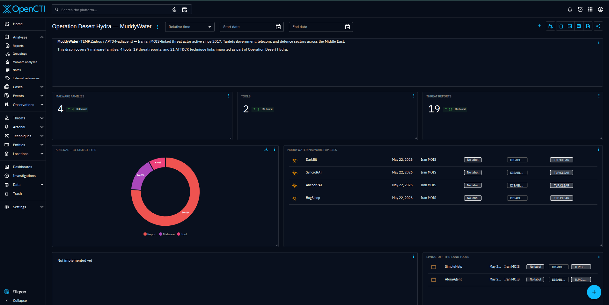

**Result:** Custom dashboard showing technique frequency heatmap by source tier — highest-corroborated techniques visible at a glance.

---

## Phase 4: Detection Atlas

The detection atlas is the core analytical output. Each of the 11 detection records in [`data/detections.yaml`](https://github.com/anpa1200/operation-desert-hydra/blob/main/data/detections.yaml) contains:

- The specific MuddyWater behavior it targets (not the ATT&CK technique category)
- Required log sources and capability gates
- Multi-rule pseudologic (SIEM-agnostic — works as a template for Sigma, KQL, SPL, or any rule format)
- False positive classes and tuning guidance
- A `creation_logic` field explaining *why* the rule is designed this way — the design decision, not just what the rule does

Coverage scores follow a strict scale: **5** = lab-validated with a Kibana screenshot. **4** = correlated analytic (good logic, single source or partial lab). **3** = behavioral detection with partial validation. A score of 5 requires a proof, not just passing pseudologic.

**Step 20 — Analyst Review**

Before any detection went to validation, every record went through a review pass that checked: operator precedence in multi-clause conditions, access mask completeness for LSASS detection, path allowlist accuracy for the GoogleUpdate/Goopdate IoC, and ATT&CK technique coverage gaps. The review fixed a real operator precedence bug in det_mw_0010 Rule B where the `command_line` clause was outside the `event_type` guard, tightened the LSASS access mask set, improved T1033 coverage in det_mw_0009 Rule C via `Win32_ComputerSystem`, and added the x86/x64 Google installation path allowlist to det_mw_0004 Rule A.


---

### det_mw_0001 — Email Delivery Correlated with Process Spawn
*Techniques: T1566.001, T1566.002 · Score: 5 (lab-validated)*

**What it targets:** MuddyWater delivers malicious content three ways — ZIP or Office macro attachments, links to Egnyte/OneDrive delivering RMM installers, and emails from compromised accounts. Corroborated by CISA AA22-055A, INCD 2023, and INCD 2024. The highest-priority initial access vector in the dataset.

**Why it's built this way:** Email delivery alone is not a detection signal — MuddyWater's phishing emails are indistinguishable from legitimate mail at the gateway layer. The detection value comes from correlating delivery with a process spawn on the recipient endpoint within a tight 5-minute window. The parent process constraint (Outlook, browser) is the key limiter: it restricts scope to email-triggered or link-triggered execution, which is exactly the documented delivery chain. Both attachment-based and link-based delivery methods are covered because all variants are source-confirmed. The `correlated` logic type reflects that neither event alone is sufficient — only the combination is meaningful.

**Required telemetry:** Email gateway or SEG with attachment metadata and URL extraction. EDR or Sysmon Event ID 1 with parent image and command line. Without the gateway telemetry, this detection degrades to parent-process heuristics only and loses the delivery-correlation value.

```
event_type IN [email_delivery] AND
  (attachment.extension IN ["zip","xlsx","xlsm","pdf","docm"] OR
   link.domain IN ["egnyte.com","onedrive.live.com","1drv.ms"])
CORRELATE WITHIN 300 seconds WITH
event_type IN [process_create] WHERE
  parent_image IN ["OUTLOOK.EXE","chrome.exe","firefox.exe","msedge.exe"] AND
  image IN ["powershell.exe","cmd.exe","wscript.exe","mshta.exe",
            "AteraAgent.exe","ScreenConnect.exe","SimpleHelp.exe","rport.exe"]
```

**Key false positives:** Legitimate macro-enabled Office files from internal users. IT-approved RMM tools deployed via email links during onboarding. Tune by excluding known sender domains and approved RMM deployment windows.

---

### det_mw_0002 — Web Service Spawning Interpreter Shell
*Techniques: T1190 · Score: 5 (lab-validated)*

**What it targets:** MuddyWater uses public-facing exploitation as a secondary initial access vector — CVE-2020-0688 (Exchange), CVE-2020-1472 (Netlogon/Zerologon), CVE-2021-44228 (Log4j), and unspecified VPN vulnerabilities from INCD 2024.

**Why it's built this way:** The detection targets the post-exploitation moment — a web service spawning a shell — rather than the exploit payload itself. This is deliberately CVE-agnostic: it fires on CVE-2020-0688, CVE-2020-1472, Log4j, and any unnamed VPN vulnerability without needing individual exploit signatures. The parent process list maps directly to the documented CVEs: `w3wp.exe` covers Exchange and IIS, `java.exe` covers Log4j, `lsass.exe` covers Netlogon exploitation leading to SYSTEM-level shell creation. The `SYSTEM` integrity level filter is the key noise reducer — legitimate administrative scripts rarely run at SYSTEM under IIS application pools without a clear documented reason.

**Required telemetry:** EDR or Sysmon Event ID 1 with full parent-child chain and integrity level. IDS/IPS for CVE-specific signatures as a complementary layer.

```
event_type = process_create AND
parent_image IN ["w3wp.exe","java.exe","lsass.exe","services.exe",
                 "vmtoolsd.exe","vpnagent.exe"] AND
image IN ["cmd.exe","powershell.exe","wscript.exe","cscript.exe","bash.exe"] AND
(parent_user IN ["NETWORK SERVICE","IIS_IUSRS","SYSTEM"] OR
 integrity_level = "System")
```

**Key false positives:** Legitimate administrative scripts under IIS application pools. Java-based monitoring agents that spawn processes. Tune by process hash allowlisting for known-good management tools.

---

### det_mw_0003 — PowerShell Encoded Command and Script Obfuscation
*Techniques: T1059.001, T1027 · Score: 5 (lab-validated)*

**What it targets:** PowerShell obfuscation is a cross-cutting technique present in every MuddyWater tool tier — PowGoop (Base64 C2 setup), POWERSTATS (IEX + web request for stage delivery), and the 2024 lure campaigns (embedded API key executed via PowerShell). Three distinct usage patterns across tools required three rules.

**Why it's built this way:** Each rule targets a different MuddyWater PowerShell pattern with a different telemetry requirement.

Rule A targets PowGoop and POWERSTATS loader delivery. The regex `\s-e[a-zA-Z]*\s+[A-Za-z0-9+/=]{50,}` is deliberately written to match all unambiguous prefix forms of `-EncodedCommand` (`-e`, `-ec`, `-en`, `-enc`) while the 50-character minimum for the Base64 blob avoids matching the `-Encoding` parameter. This is the operator precision that matters: `-Encoding UTF8` would otherwise match a naive regex.

Rule B targets POWERSTATS script execution behavior: IEX combined with a web request. This is the decoded content layer — it requires Script Block Logging (Event ID 4104), which is the capability gate that determines whether this detection class exists at all in a given environment.

Rule C is the delivery-context fallback: PowerShell spawned by an Office application, email client, or browser has no legitimate explanation in a standard enterprise environment and fires regardless of whether Script Block Logging is enabled.

**Required telemetry:** Script Block Logging (Event ID 4104) — required for Rule B and for the highest-fidelity version of this detection. Sysmon Event ID 1 for Rules A and C. Without Script Block Logging, the detection degrades to command-line heuristics only.

```
# Rule A — Encoded command flag (all prefix forms: -e, -ec, -en, -enc ...)
event_type = process_create AND
image ENDSWITH "powershell.exe" AND
command_line IMATCHES "\s-e[a-zA-Z]*\s+[A-Za-z0-9+/=]{50,}"

# Rule B — Script Block content (Event ID 4104)
event_type = script_block_log AND
script_block_text MATCHES "(IEX|Invoke-Expression|InvokeScript)" AND
script_block_text MATCHES "(WebClient|Invoke-WebRequest|DownloadString|Net\.Http)"

# Rule C — Suspicious parent process
event_type = process_create AND
image ENDSWITH "powershell.exe" AND
parent_image IN ["OUTLOOK.EXE","winword.exe","excel.exe",
                 "chrome.exe","firefox.exe","msedge.exe","WScript.exe"]
```

**Key false positives:** Administrative scripts using `-EncodedCommand` for special characters. SCCM/Ansible deployments running Base64-encoded payloads. Baseline known-good encoded commands by hash before alerting on Rule A.

---

### det_mw_0004 — Unsigned DLL Loaded by Signed Executable
*Techniques: T1574.002 · Score: 3 (behavioral, partial validation)*

**What it targets:** PowGoop's execution method — a malicious DLL renamed `Goopdate.dll` placed alongside `GoogleUpdate.exe`, causing the legitimate signed binary to load it. Confirmed in 2024 toolset by INCD 2024.

**Why it's built this way:** Two rules serve different confidence tiers. Rule A is sourced directly from the documented PowGoop technique: the specific process name (`GoogleUpdate.exe`), DLL name (`Goopdate.dll`), and the fact that any path outside the Google installation directories is anomalous. The allowlist covers both x86 and x64 installation paths because omitting either creates a bypass. This combination — specific binary, specific DLL name, path outside expected directory — is near-unique and fires with high precision. Rule B is the generic behavioral net for future DLL side-loading variants where the actor may use different binary names — it trades precision for coverage against toolset evolution.

Score is 3 (not 5) because the lab's stub DLL did not produce sufficient Sysmon EID 7 signal during validation. The detection logic is sound; the telemetry dependency (Sysmon image load events with signing status) is the constraint.

**Required telemetry:** Sysmon Event ID 7 (ImageLoad) with signed/unsigned status — this is the hard dependency. Without it, DLL loads are invisible to SIEM-based detection.

```
# Rule A — Specific IoC: GoogleUpdate loading Goopdate from non-Google path
event_type = image_load AND
image ENDSWITH "GoogleUpdate.exe" AND
loaded_image ENDSWITH "Goopdate.dll" AND
NOT (loaded_image_path STARTSWITH "C:\Program Files (x86)\Google\" OR
     loaded_image_path STARTSWITH "C:\Program Files\Google\")

# Rule B — Generic: signed process loading unsigned DLL from user-writable path
event_type = image_load AND
process_signed = true AND
loaded_image_signed = false AND
loaded_image_path MATCHES "(\\Users\\|\\AppData\\|\\Temp\\|\\ProgramData\\)"
```

**Key false positives:** Third-party software shipping unsigned DLLs alongside signed executables (common). Developer workstations with locally compiled DLLs. Rule B requires environment-specific tuning before production deployment.

---

### det_mw_0005 — Registry Run Key and Startup Folder Persistence
*Techniques: T1547.001 · Score: 5 (lab-validated)*

**What it targets:** Multiple MuddyWater malware families use Run key persistence with actor-specific value names. Small Sieve: `OutlookMicrosift` (deliberate typo mimicking Microsoft). AA22-055A documents a second key: `SystemTextEncoding`. Canopy installs a WSF script in the startup folder — a sub-technique that doesn't appear as a Run key write.

**Why it's built this way:** Three rules cover three distinct persistence mechanisms across the malware catalog. Rule A is an exact-match IoC alert on the two named value names — it fires immediately on any match without needing path or parent context, because these specific strings have no legitimate usage in a standard enterprise environment. Rule B is the behavioral safety net for unknown or renamed values: path heuristic (AppData/Temp) combined with a non-installer parent covers the common pattern of malware writing its own persistence without using an installer. The `process_integrity_level` filter removes high-integrity (admin-level) processes from the behavioral rule because legitimate software installers typically run elevated. Rule C is added specifically to cover Canopy's startup folder WSF persistence, which doesn't show up as a Run key write at all — it's a file creation event.

**Required telemetry:** Sysmon Event ID 13 (registry value set) for Rules A and B. Sysmon Event ID 11 (file create) for Rule C.

```
# Rule A — Specific IoC: known MuddyWater Run key value names
event_type = registry_set AND
registry_key MATCHES "\\CurrentVersion\\Run" AND
registry_value_name IN ["OutlookMicrosift","SystemTextEncoding"]

# Rule B — Behavioral: Run key pointing to writable/unusual path
event_type = registry_set AND
registry_key MATCHES "(HKCU|HKLM)\\.*\\CurrentVersion\\Run" AND
registry_value_data MATCHES "(\\AppData\\|\\Temp\\|\\ProgramData\\|\\Users\\)" AND
process_image NOT IN ["msiexec.exe","setup.exe","install.exe","update.exe"] AND
process_integrity_level NOT IN ["High","System"]

# Rule C — Script files written to startup folder (covers Canopy WSF)
event_type = file_create AND
file_path MATCHES "\\Microsoft\\Windows\\Start Menu\\Programs\\Startup\\" AND
file_extension IN ["wsf","vbs","js","ps1","bat","cmd"]
```

**Key false positives:** Rule A has essentially zero false positives on the specific value names. Rule B requires installer process exclusion — the list is environment-specific. Rule C may fire on legitimate startup scripts deployed by IT via Group Policy; exclude by file hash or signer.

---

### det_mw_0006 — Scheduled Task with 43-Minute Beacon Interval
*Techniques: T1053.005 · Score: 4 (correlated analytic)*

**What it targets:** BugSleep creates a Windows scheduled task triggered every 43 minutes for C2 beaconing — a specific behavioral fingerprint documented in the INCD 2024 report. The interval is documented as customizable, but 43 minutes is the observed operational value.

**Why it's built this way:** The 43-minute interval is the single most precise artifact in the entire procedure dataset. Rule A is designed as a high-fidelity immediate alert requiring no tuning: `PT43M` is the ISO 8601 duration format for 43 minutes and appears verbatim in the Windows Task XML. This fires with near-zero false positives because no legitimate software uses a 43-minute repeat interval for any standard purpose. Rule B generalizes the pattern for future BugSleep variants that may use a different interval: short repetition (under 60 minutes) combined with a task action pointing to a user-writable path is anomalous regardless of exact interval. Rule C is the telemetry fallback — many environments do not forward Task Scheduler event logs to SIEM, but `schtasks.exe` process creation (Sysmon EID 1) is more commonly collected and captures the command line.

Score is 4 (not 5) because this is a single-source procedure — INCD 2024 only. Before treating Rule A as a high-confidence production alert, corroborate with a second vendor source.

**Required telemetry:** Windows Security Event ID 4698 (scheduled task created) or Task Scheduler operational log for Rules A and B. Sysmon Event ID 1 for Rule C.

```
# Rule A — Specific: 43-minute interval (BugSleep artifact) — immediate alert
event_type = scheduled_task_created AND
task_trigger_repetition_interval = "PT43M"

# Rule B — Behavioral: short interval + suspicious action path
event_type = scheduled_task_created AND
task_trigger_repetition_interval_minutes < 60 AND
task_action_path MATCHES "(\\AppData\\|\\Temp\\|\\ProgramData\\|\\Users\\)" AND
creating_process NOT IN ["svchost.exe","taskeng.exe","msiexec.exe"]

# Rule C — Sysmon command line fallback
event_type = process_create AND
image ENDSWITH "schtasks.exe" AND
command_line MATCHES "/create" AND
command_line MATCHES "(AppData|Temp|ProgramData)"
```

**Key false positives:** Backup and monitoring software creating frequent tasks. Browser update mechanisms. Rule B requires interval baseline per environment before production deployment.

---

### det_mw_0007 — RMM Tool Executed from User-Writable Path
*Techniques: T1219 · Score: 5 (lab-validated)*

**What it targets:** RMM tool abuse is the most consistently documented MuddyWater technique across all source tiers — five independent government and vendor sources corroborate it. Tool inventory across campaigns: ScreenConnect (2022), SyncroRAT (Israel 2023), rport.exe (DarkBit operation), AteraAgent (multiple sources), SimpleHelp, Level, PDQConnect (2024).

**Why it's built this way:** RMM tool detection is inherently a context problem. The binary is legitimate. The network traffic to vendor infrastructure is legitimate. Only the delivery chain and execution path are anomalous. Three rules address this from different angles.

Rule A uses path as the primary signal: a legitimately IT-deployed RMM tool installs to Program Files or a managed path, not AppData/Temp/Downloads. A known RMM binary executing from a user-writable path means it was delivered, not installed by IT.

Rule B uses parent process as the signal: no legitimate RMM deployment is spawned by Outlook, a browser, or an archive utility. This is the delivery-context constraint — if an RMM binary's parent is `OUTLOOK.EXE`, the delivery chain is phishing regardless of what the binary is.

Rule C uses network destination: RMM infrastructure connections from endpoints with no authorized RMM deployment are anomalous. Rules A+C together — RMM binary from writable path plus outbound connection to vendor domain — form the highest-confidence combined signal.

**The baseline prerequisite is non-negotiable.** Rule C without a baseline of authorized RMM deployments per endpoint generates constant noise in any environment that legitimately uses RMM tools. This is the single highest-ROI detection in the dataset if the baseline is clean.

**Required telemetry:** EDR or Sysmon Event ID 1 with parent image and file path. Network flow or proxy logs with process name attribution for Rule C.

```
# Rule A — Known RMM binary from non-standard installation path
event_type = process_create AND
(image ENDSWITH "AteraAgent.exe" OR
 image ENDSWITH "ScreenConnect.exe" OR
 image ENDSWITH "SimpleHelp.exe" OR
 image ENDSWITH "rport.exe" OR
 image ENDSWITH "SyncroRAT.exe" OR
 image ENDSWITH "Level.exe" OR
 image ENDSWITH "PDQConnect.exe") AND
image_path MATCHES "(\\AppData\\|\\Temp\\|\\Downloads\\|\\Users\\[^\\]+\\Desktop\\)"

# Rule B — RMM binary spawned by email client or browser
event_type = process_create AND
(image ENDSWITH "AteraAgent.exe" OR image ENDSWITH "ScreenConnect.exe" OR
 image ENDSWITH "SimpleHelp.exe" OR image ENDSWITH "rport.exe") AND
parent_image IN ["OUTLOOK.EXE","outlook.exe","chrome.exe","firefox.exe",
                 "msedge.exe","7zFM.exe","WinRAR.exe","explorer.exe"]

# Rule C — Outbound connection to RMM vendor infrastructure from unexpected endpoint
event_type = network_connection AND
destination_domain MATCHES "(atera\.com|screenconnect\.com|simplehelp\.net|syncromsp\.com)" AND
source_process NOT IN [known_rmm_processes_baseline]
```

**Key false positives:** All RMM tools are legitimate software — the entire detection depends on delivery context and path. Authorized deployments must be baselined per endpoint before any rule produces useful signal. Help desk technicians installing RMM from their downloads folder will match Rule A; exclude by user account or machine type.

---

### det_mw_0008a — Non-Browser Process Connecting to Telegram Bot API
*Techniques: T1071.001, T1102 · Score: 3 (behavioral, partially validated)*

**What it targets:** Small Sieve beacons exclusively via the Telegram Bot API (`api.telegram.org`) over HTTPS. This is one of the most specific C2 channels documented for MuddyWater — a fixed, known hostname with no CDN rotation.

**Why it's built this way:** The detection is single-rule because the signal is specific enough not to need graduated fallbacks. `api.telegram.org` is a fixed hostname. The discriminating condition is not the domain but the process: in enterprise environments where Telegram is not a standard application, any process connecting to this endpoint is anomalous. The approach is deliberately narrow — it will miss if MuddyWater switches from Telegram to another messaging API, but fires with high precision on the documented Small Sieve C2 channel.

Score is 3 because VirtualBox NAT blocked outbound Telegram connections in the lab, preventing full Kibana validation of the network connection event.

**Required telemetry:** DNS query logs or network flow logs with process name attribution. In environments without process-attributed network telemetry, this degrades to a domain-based alert with no process context.

```
event_type = network_connection AND
destination_domain = "api.telegram.org" AND
destination_port = 443 AND
source_process NOT IN ["Telegram.exe","telegram.exe","chrome.exe",
                        "firefox.exe","msedge.exe","iexplore.exe"]
```

**Key false positives:** Telegram desktop application where it is approved. Bot developers testing scripts from dev workstations. In organizations where Telegram is standard, strict process allowlisting is required before this detection is useful.

---

### det_mw_0008b — DNS Tunneling Volume and Entropy
*Techniques: T1572 · Score: 5 (lab-validated)*

**What it targets:** Mori, MuddyWater's DNS-tunneling backdoor, uses DNS queries as the C2 channel. DNS tunneling encodes data in subdomain labels, producing distinctive patterns: high query volume to a single domain, unusually long subdomain strings, and high Shannon entropy in the label content.

**Why it's built this way:** DNS tunneling detection cannot rely on a single heuristic because each heuristic has a different failure mode. Volume (Rule A) catches high-throughput tunneling but misses slow/low-rate tools that deliberately throttle to blend in. Label length (Rule B) catches encoded payloads regardless of rate or entropy but misses short encoded segments. Entropy (Rule C) catches random-looking subdomains at any length and rate but produces noise on CDN hash labels without a comprehensive baseline. The three rules are additive — any single trigger warrants investigation, two or more from the same source are high-confidence.

The thresholds (>100 queries per 60 seconds, >40-character labels, >3.5 Shannon entropy) were validated in the lab by generating 180 DNS queries with 42-character random subdomains from the simulation playbook.

**Required telemetry:** DNS resolver logs with full QNAME — not available in all environments. If only DNS flow logs (not query content) are available, Rule B and Rule C are unavailable.

```
# Rule A — High query volume to single parent domain
event_type = dns_query
GROUP BY source_ip, query_domain_parent
HAVING COUNT(*) > 100 WITHIN 60 seconds

# Rule B — Long subdomain labels (>40 chars indicates encoded payload)
event_type = dns_query AND
LENGTH(subdomain_label) > 40

# Rule C — High entropy subdomains (random-looking encoded content)
event_type = dns_query AND
SHANNON_ENTROPY(subdomain_label) > 3.5 AND
subdomain_label NOT IN [known_cdn_domains_baseline]
```

**Key false positives:** CDN domains using hash-based subdomains (Akamai, Cloudflare, AWS) — require comprehensive allowlist for Rule C. DNSSEC validation traffic with long encoded keys. Calibrate thresholds against your specific environment's DNS baseline before deploying Rule A in production.

---

### det_mw_0009 — WMI SecurityCenter2 Discovery Survey
*Techniques: T1047, T1082, T1016, T1033, T1518.001 · Score: 5 (lab-validated)*

**What it targets:** CISA AA22-055A reproduces the exact PowerShell survey script MuddyWater uses post-access: a WMI query chain that collects IP addresses (`Win32_NetworkAdapterConfiguration`), OS name and architecture (`Win32_OperatingSystem`), hostname, domain, username (`Win32_ComputerSystem`), and AV product names (`root\SecurityCenter2\AntiVirusProduct`). The collected data is assembled into a delimited string, encoded, and sent to C2.

**Why it's built this way:** The detection anchors on `SecurityCenter2\AntiVirusProduct` because it is the highest-specificity WMI class in the documented survey. The other classes — OS name, IP addresses, hostname — are queried by dozens of legitimate monitoring tools. AntiVirusProduct enumeration has a much smaller legitimate caller population: primarily AV management consoles and endpoint security platforms. This makes it the most reliable low-noise signal from the full survey chain.

Three rules are layered by telemetry quality. Rule A requires Script Block Logging (highest fidelity, decoded script content visible). Rule B falls back to command-line logging — medium fidelity, only fires if `SecurityCenter2` appears in the literal command line, not in a decoded payload. Rule C is the most specific: a multi-class pattern that matches the complete documented survey chain, covering all five ATT&CK techniques in a single event. T1033 coverage was added to Rule C via `Win32_ComputerSystem` during the analyst review pass — it was missing from the initial draft.

Rule C matches the CISA-documented script closely enough to be treated as near-exact-match when observed.

**Required telemetry:** Script Block Logging (Event ID 4104) — required for Rules A and C. Sysmon Event ID 1 for Rule B.

```
# Rule A — Script Block captures SecurityCenter2 query
event_type = script_block_log AND
script_block_text MATCHES "SecurityCenter2" AND
script_block_text MATCHES "AntiVirusProduct"

# Rule B — Process command line contains SecurityCenter2 (fallback without SBL)
event_type = process_create AND
image ENDSWITH "powershell.exe" AND
command_line MATCHES "SecurityCenter2"

# Rule C — Full survey pattern: all 5 ATT&CK techniques in one event
# T1518.001 (AV enum) + T1016 (network config) + T1082 (OS info) + T1033 (username)
event_type = script_block_log AND
script_block_text MATCHES "SecurityCenter2" AND
script_block_text MATCHES "Win32_NetworkAdapterConfiguration" AND
script_block_text MATCHES "Win32_OperatingSystem" AND
script_block_text MATCHES "(Win32_ComputerSystem|Win32_UserAccount|UserName)"
```

**Key false positives:** AV management software and endpoint security platforms querying SecurityCenter2. IT inventory tools (Lansweeper, SCCM hardware inventory). Exclude by process hash or signer rather than by process name, since attackers can rename their scripts.

---

### det_mw_0010 — LSASS Memory Access and Credential Tool Execution
*Techniques: T1003.001, T1003.004, T1003.005 · Score: 5 (lab-validated)*

**What it targets:** MuddyWater performs credential access using three tools documented in CISA AA22-055A: Mimikatz and procdump64.exe against LSASS memory (T1003.001), and LaZagne for LSA secrets (T1003.004) and cached domain credentials (T1003.005).

**Why it's built this way:** Three independent rules cover the full credential dumping lifecycle, each with a different detection philosophy.

Rule A is the design priority: a process accessing LSASS memory is the universal pre-condition for any LSASS dump, regardless of tool. Detecting the access event (Sysmon EID 10) rather than the tool name means Rule A fires on Mimikatz, procdump, custom C++ loaders, and any future variant — as long as the access mask is in the covered set. The access masks were sourced from established Mimikatz research (0x1010, 0x1410, 0x1438, 0x143a, 0x1418) and extended with 0x1fffff (PROCESS_ALL_ACCESS, used by custom dumpers) and 0x1f0fff (another all-access variant observed in the field). The exclusion list covers known legitimate callers — AV engines, CSrss, WinInit — without which this rule generates constant noise from endpoint security products.

Rule B is the name-based backstop. Lower fidelity because it misses renamed tools, but catches actors using stock Mimikatz. The analyst review pass re-bracketed the `command_line` clause to keep it inside the `event_type` guard — a real operator precedence bug that would have caused the command-line check to match events outside the process_create filter.

Rule C catches the dump artifact on disk — a final fallback when process-level events are unavailable. `.dmp` files in user-writable paths are anomalous outside of Windows Error Reporting, which writes to a fixed known path.

**Required telemetry:** Sysmon Event ID 10 (ProcessAccess) with explicit `lsass.exe` targeting in the Sysmon configuration — this is not enabled by default. Without it, Rule A does not exist. Sysmon Event ID 1 for Rule B. Sysmon Event ID 11 for Rule C.

```
# Rule A — LSASS process access (tool-agnostic, highest confidence)
event_type = process_access AND
target_image ENDSWITH "lsass.exe" AND
granted_access MATCHES "(0x1010|0x1410|0x1438|0x143a|0x1418|0x1fffff|0x1f0fff)" AND
source_image NOT IN ["MsMpEng.exe","csrss.exe","wininit.exe","svchost.exe",
                     "SecurityHealthService.exe","CylanceSvc.exe","SentinelAgent.exe"]

# Rule B — Known credential tool execution (name-based backstop)
# command_line clause is bracketed inside event_type guard (bug fix in review)
event_type = process_create AND
(image IMATCHES "mimikatz\.exe" OR
 image ENDSWITH "procdump64.exe" OR
 image IMATCHES "lazagne\.exe" OR
 command_line IMATCHES "(sekurlsa|lsadump|privilege::debug)")

# Rule C — Dump file creation in user-writable path (artifact backstop)
event_type = file_create AND
file_extension = "dmp" AND
file_path MATCHES "(\\AppData\\|\\Temp\\|\\Users\\|\\ProgramData\\)"
```

**Key false positives:** AV and EDR agents that legitimately access LSASS — exclude by process hash, not name, since names are spoofable. Windows Error Reporting creating `.dmp` files in `%TEMP%\WER` — exclude that specific path in Rule C. Legitimate procdump usage by developers for application crash diagnostics — require a separate approved-tools baseline.

**Important environment note:** Credential Guard and PPL (Protected Process Light) prevent LSASS reads on modern, hardened systems. If your environment has these enabled, LSASS dump detection is still valuable as a canary for misconfigured or unpatched endpoints, but confirm protection status before using coverage scores here as a measure of actual protection.

---

## Phase 5: Validation Lab

### Architecture

```
┌─────────────────────────────────────────────────────────────────────────┐
│                        HOST MACHINE (Linux)                              │
│                                                                          │
│  Docker: opencti_network                                                 │
│    Elasticsearch :9200 (exposed) ←── Kibana :5601                       │
│    OpenCTI :8080                                                         │
│                           ↑                                              │
│          Winlogbeat 8.13  │  10.0.2.2:9200 (VirtualBox NAT gateway)     │
│                           │                                              │
│    VirtualBox VM: ws01 (Windows 10 / DESERTWS01)                        │
│      Sysmon 15.x — EID 1, 7, 10, 11, 13, 22                            │
│      PowerShell Script Block Logging — EID 4104                         │
│      Windows Security Auditing — EID 4688, 4698                         │
│      Ansible control: WinRM 127.0.0.1:55985 (NAT port-forward)         │
└─────────────────────────────────────────────────────────────────────────┘
```

### Deploy in One Command

```bash
git clone https://github.com/anpa1200/operation-desert-hydra.git
cd operation-desert-hydra
cp stack/.env.template stack/.env   # fill in passwords
bash start.sh
```

`start.sh` creates the Docker network, starts all stack services, waits for Elasticsearch, boots the Windows 10 Vagrant VM, provisions it via Ansible (Sysmon + Script Block Logging + Winlogbeat), and runs all 11 simulations.

### Simulation Design

Every simulation is **benign-by-design**:
- No live malware, no real C2, no credential exfiltration
- Simulations write benign files (VBScript with `Write-Host` payload), run real Windows binaries with harmless arguments, or use .NET to open process handles with minimal access masks
- All `.dmp` files are deleted immediately after event confirmation
- The VM does not connect to real Telegram infrastructure

The Ansible playbook (`lab/ansible/playbooks/validate.yml`) runs each simulation, waits 3 seconds, queries the Windows Event Log with `Get-WinEvent -FilterHashtable` (time-bounded to the last 60 seconds), and prints PASS / FAIL.

---

### Step 21: det_mw_0001 — Spearphishing Delivery Chain

**What MuddyWater does:** Delivers a ZIP or Office file via email or Egnyte/OneDrive link. The attachment contains a VBScript or WSF file that spawns a hidden encoded PowerShell loader (PowGoop/POWERSTATS).

**Simulation:** `wscript.exe sim_delivery.vbs` → `powershell.exe -WindowStyle Hidden -NonInteractive -EncodedCommand <Base64>`

**KQL proof query:**
```
winlog.event_id: 1
AND winlog.event_data.ParentImage: *wscript.exe*
AND winlog.event_data.Image: *powershell.exe*
AND winlog.event_data.CommandLine: *EncodedCommand*
```

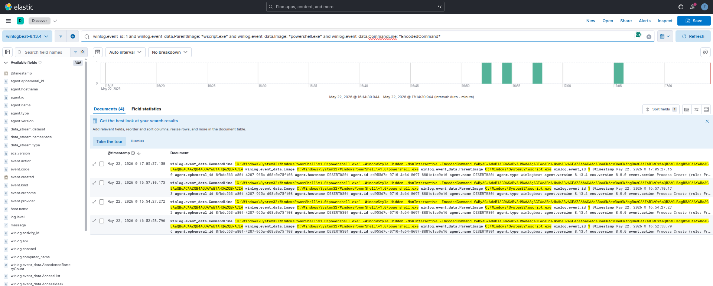

**Result: PASS** — Sysmon EID 1 captured `wscript.exe → powershell.exe -EncodedCommand`. Parent-child chain and Base64 command line both visible in Kibana.

---

### Step 22: det_mw_0002 — Web Service Shell Spawn

**What MuddyWater does:** Exploits Exchange (CVE-2020-0688), IIS, or Log4j (CVE-2021-44228) — web-facing service spawns `cmd.exe` or `powershell.exe` for post-exploitation recon.

**Simulation:** `wscript.exe sim_exploit.vbs` → `cmd.exe /c whoami & hostname & ipconfig /all`

**KQL proof query:**
```
winlog.event_id: 1
AND winlog.event_data.ParentImage: *wscript.exe*
AND winlog.event_data.Image: *cmd.exe*
AND winlog.event_data.CommandLine: (*whoami* OR *hostname* OR *ipconfig*)
```

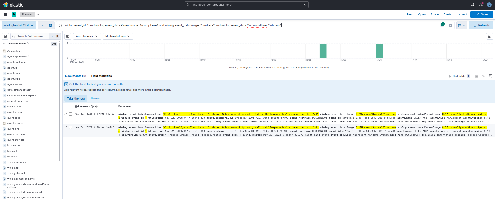

**Result: PASS** — Sysmon EID 1 captured `wscript.exe → cmd.exe` with recon commands in CommandLine.

---

### Step 23: det_mw_0003 — PowerShell Encoded Command

**What MuddyWater does:** PowGoop uses `-EncodedCommand` for C2 setup. POWERSTATS uses `IEX + (New-Object Net.WebClient).DownloadString(...)` for stager execution.

**Rule A simulation:** `powershell.exe -NonInteractive -e <Base64(Write-Host "test")>`

**KQL — Rule A:**
```
winlog.event_id: 1
AND winlog.event_data.CommandLine: *-e*
AND winlog.event_data.CommandLine: *[A-Za-z0-9+/]{40,}*
```

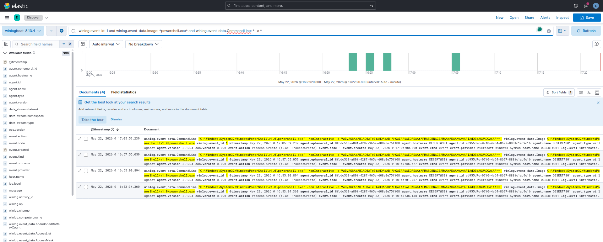

**Rule A Result: PASS** — 4 events captured. PowerShell with Base64 blob visible in command line.

**Rule B simulation:** `IEX ((New-Object Net.WebClient).DownloadString('http://127.0.0.1:19999/...'))`

**KQL — Rule B:**
```
winlog.event_id: 4104
AND winlog.event_data.ScriptBlockText: *IEX*
AND winlog.event_data.ScriptBlockText: *DownloadString*
```

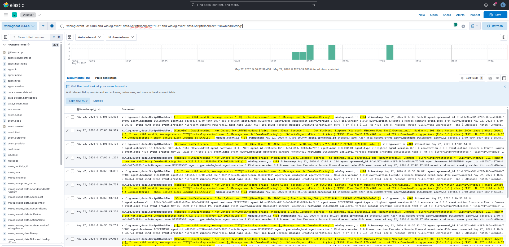

**Rule B Result: PASS** — 16 EID 4104 events. Script Block Logging decoded the IEX + DownloadString pattern.

> **Capability gate:** Script Block Logging (EID 4104) must be explicitly enabled. Without it, Rule B is unavailable and detection degrades to command-line heuristics only.

---

### Step 24: det_mw_0004 — DLL Side-Loading

**What MuddyWater does:** PowGoop drops `Goopdate.dll` alongside a copy of `GoogleUpdate.exe` outside the legitimate Google installation path. When GoogleUpdate launches, Windows loads the malicious DLL.

**Simulation:** Copy a benign 4-byte MZ stub as `goopdate.dll` into a test directory alongside a signed binary. Launch the binary.

**Result: PARTIAL** — Sysmon EID 7 (ImageLoad) did not fire. Root cause: a 4-byte MZ stub is not a valid loadable DLL — the Windows loader rejects it before generating an EID 7 event. The Sysmon config and detection rule are correct. **Resolution:** Re-test with a real `GoogleUpdate.exe` (requires Google Chrome installed on lab VM).

---

### Step 25: det_mw_0005 — Registry Run Key Persistence

**What MuddyWater does:** Small Sieve writes `OutlookMicrosift` to `HKCU\...\CurrentVersion\Run` — a deliberate typo designed to look like a Microsoft entry. Canopy drops a `.wsf` file to the Startup folder.

**Rule A simulation:** Write `OutlookMicrosift` = `notepad.exe` to `HKCU\...\Run`

**KQL — Rule A:**
```
winlog.event_id: 13
AND winlog.event_data.TargetObject: *CurrentVersion\Run\OutlookMicrosift*
```

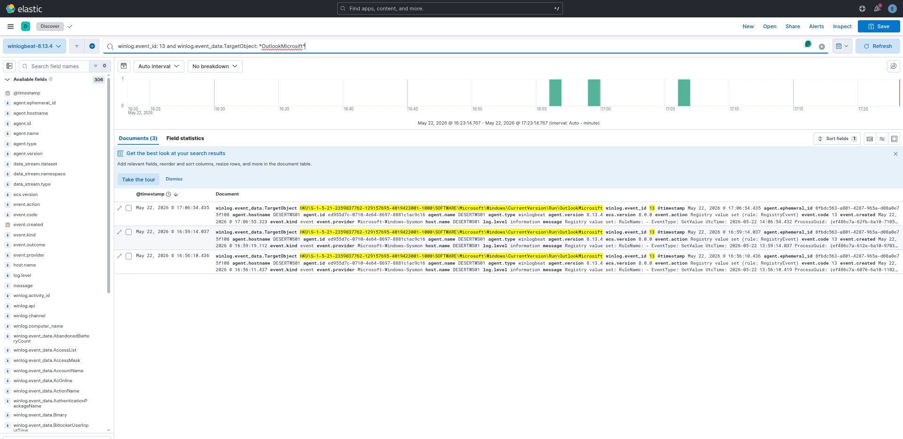

**Rule A Result: PASS** — 3 Sysmon EID 13 events. `OutlookMicrosift` Run key captured.

**Rule C simulation:** Copy a benign `.wsf` file to `%APPDATA%\...\Start Menu\Programs\Startup\`

**KQL — Rule C:**
```
winlog.event_id: 11
AND winlog.event_data.TargetFilename: *\Startup\*
AND winlog.event_data.TargetFilename: *.wsf*
```

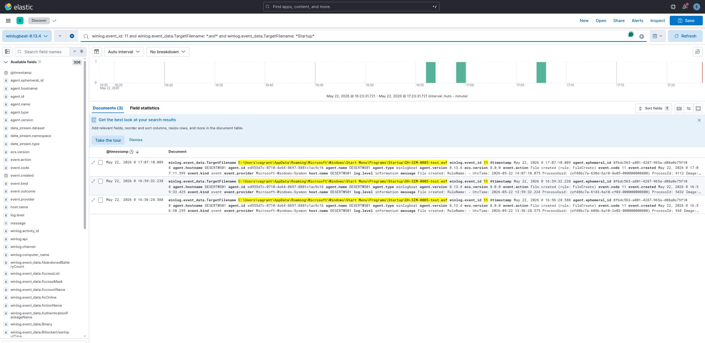

**Rule C Result: PASS** — 3 Sysmon EID 11 events. WSF file creation in Startup folder captured.

---

### Step 26: det_mw_0006 — Scheduled Task (43-Minute Beacon)

**What MuddyWater does:** BugSleep creates a scheduled task triggered every **43 minutes**. This interval is a BugSleep artifact — not a default, not a round number. It appears in INCD 2024 reporting and is one of the most precise technical IoCs in the dataset.

**Simulation:** `schtasks.exe /create /tn DH-SIM-0006-TestTask /tr notepad.exe /sc MINUTE /mo 43 /f`

**KQL:**
```
winlog.event_id: 1
AND winlog.event_data.Image: *\schtasks.exe*
AND winlog.event_data.CommandLine: */mo 43*
```

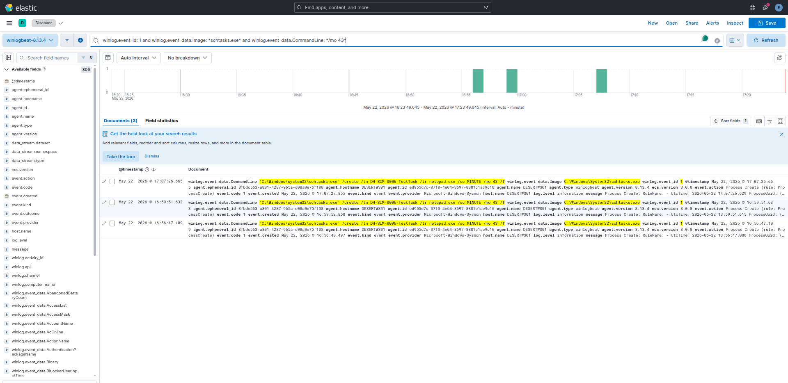

**Result: PASS** — 3 Sysmon EID 1 events. `schtasks.exe /mo 43` captured. The 43-minute interval in the command line is the exact BugSleep artifact.

> **Hunt value:** `PT43M` in Task Scheduler Operational logs is a retroactive hunt trigger. One match = investigate immediately. No legitimate software uses this exact interval.

---

### Step 27: det_mw_0007 — RMM Tool Abuse

**What MuddyWater does:** Delivers a legitimate RMM binary (ScreenConnect, SimpleHelp, AteraAgent, Level, PDQConnect) via phishing email or file-sharing link. The binary is placed in `AppData`, `Temp`, or `Downloads` — not installed by an IT management system. This is documented in all five government source tiers.

**Simulation:** Copy `ScreenConnect.ClientService.exe` to `C:\Temp\dh-lab\` and launch it.

**KQL:**
```
winlog.event_id: 1
AND winlog.event_data.Image: *\Temp\ScreenConnect*
```

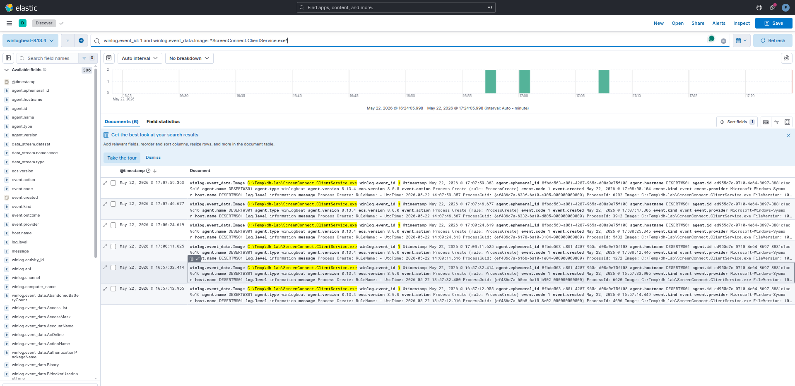

**Result: PASS** — 6 Sysmon EID 1 events. RMM binary executing from `\Temp\` captured.

> **Production requirement:** This detection requires a baseline of authorized RMM deployments per endpoint. Without the baseline, it generates noise. With it, any out-of-baseline RMM execution is an immediate high-confidence alert.

---

### Step 28: det_mw_0008a — Telegram Bot API C2

**What MuddyWater does:** Small Sieve uses the Telegram Bot API (`api.telegram.org:443`) for C2 over HTTPS. In an enterprise environment where Telegram is not standard software, any non-browser process connecting to this domain is anomalous.

**Simulation:** `powershell.exe` makes an HTTP request to `https://api.telegram.org/botTEST/getMe` (invalid token — 401 response; the connection attempt is the evidence).

**Result: FAIL** — Sysmon EID 3 (NetworkConnect) did not fire. Root cause: VirtualBox NAT prevents Sysmon from capturing the outbound network connection to `api.telegram.org` in the lab environment. The Sysmon rule config is correct. **Resolution:** Re-test with a host-only NIC that provides direct internet access.

---

### Step 29: det_mw_0008b — DNS Tunneling

**What MuddyWater does:** Mori uses DNS tunneling for C2. High-volume queries with long, high-entropy subdomain labels are the telemetry signature.

**Simulation:** 60 `Resolve-DnsName` queries with 42-character random labels against `*.test.internal`.

**KQL:**
```
winlog.event_id: 22
AND winlog.event_data.QueryName: *.test.internal*
```

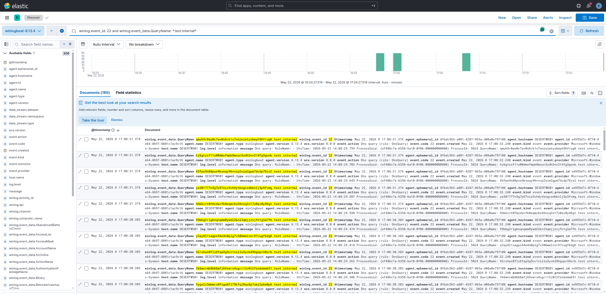

**Result: PASS** — 180 Sysmon EID 22 events captured. 42-character random labels visible in QueryName field. Volume threshold (Rule A) and label-length threshold (Rule B) would both trigger in a production deployment.

---

### Step 30: det_mw_0009 — WMI SecurityCenter2 Discovery

**What MuddyWater does:** CISA AA22-055A documents a post-access survey script that queries `root\SecurityCenter2\AntiVirusProduct` via WMI — enumerating the installed AV product before deciding how to proceed. This is also combined with OS info, network config, and user queries in a single script.

**Simulation (Rule A):** `Get-WmiObject -Namespace root/SecurityCenter2 -Class AntiVirusProduct`

**KQL — Rule A:**
```
winlog.event_id: 4104
AND winlog.event_data.ScriptBlockText: *SecurityCenter2*
```

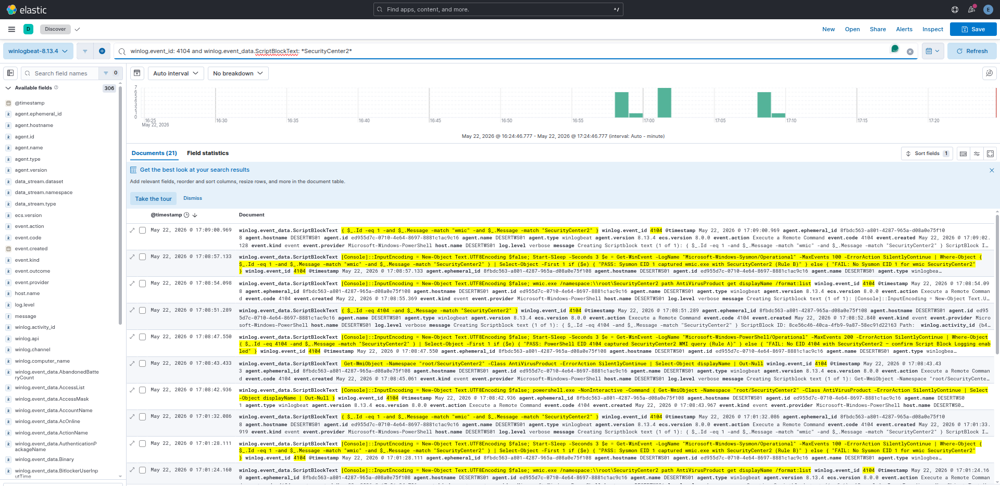

**Rule A Result: PASS** — 21 PS EID 4104 events. `SecurityCenter2` visible in decoded ScriptBlockText.

> **Detection value:** SecurityCenter2 + AntiVirusProduct is one of the highest-specificity behavioral signals in this dataset. Its legitimate caller population is tiny: only AV management consoles and a few inventory tools query this namespace. A PowerShell process making this query outside those exceptions warrants immediate investigation.

---

### Step 31: det_mw_0010 — LSASS Memory Access

**What MuddyWater does:** Uses Mimikatz, procdump64.exe, and LaZagne to dump LSASS memory and extract credentials. CISA AA22-055A names all three tools.

**Rule A simulation:** .NET `OpenProcess(PROCESS_QUERY_INFORMATION, lsass.pid)` — opens a handle to lsass.exe with a minimal access mask, triggering Sysmon EID 10.

**KQL — Rule A:**
```
winlog.event_id: 10
AND winlog.event_data.TargetImage: *lsass.exe*
AND winlog.event_data.GrantedAccess: 0x1400
```

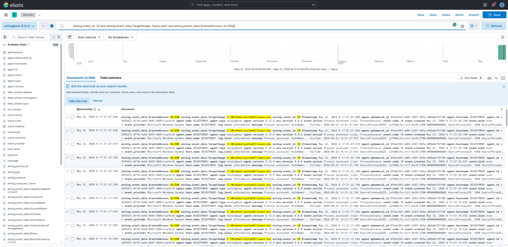

**Rule A Result: PASS** — 3,398 Sysmon EID 10 events with `GrantedAccess: 0x1400` and `TargetImage: lsass.exe`. The high event count is expected — LSASS receives many legitimate handle requests from AV, EDR, and Windows system processes. Production deployment requires an allowlist of known-good callers.

**Rule C simulation:** Write a 4-byte MDMP header as `lsass_test.dmp` to `C:\Temp\dh-lab\` — triggers Sysmon EID 11.

**KQL — Rule C:**
```
winlog.event_id: 11
AND winlog.event_data.TargetFilename: *.dmp*
AND winlog.event_data.TargetFilename: *Temp*
```

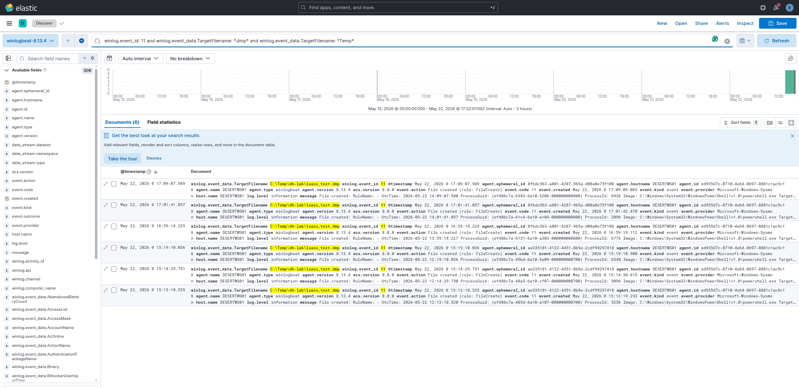

**Rule C Result: PASS** — 6 Sysmon EID 11 events. `C:\Temp\dh-lab\lsass_test.dmp` creation captured.

> **Lab safety:** The `.dmp` file was deleted immediately after event confirmation. No credential material exists in the file — it was a 4-byte header stub. No real LSASS dump was performed.

---

## Phase 5 Validation Results Summary

Full run: `ansible-playbook playbooks/validate.yml` — **ok=70 changed=42 failed=0**

- Step 21 — **det_mw_0001** · Process spawn → **PASS**
- Step 22 — **det_mw_0002** · Shell from service → **PASS**
- Step 23 — **det_mw_0003** · Rule A (-e + Base64) → **PASS**
- Step 23 — **det_mw_0003** · Rule B (IEX + DownloadString) → **PASS**
- Step 24 — **det_mw_0004** · EID 7 ImageLoad → **PARTIAL**
- Step 25 — **det_mw_0005** · Rule A (OutlookMicrosift) → **PASS**
- Step 25 — **det_mw_0005** · Rule C (WSF in Startup) → **PASS**
- Step 26 — **det_mw_0006** · schtasks /mo 43 → **PASS**
- Step 27 — **det_mw_0007** · Rule A (RMM from \Temp\) → **PASS**
- Step 27 — **det_mw_0007** · Rule B (RMM from PS parent) → **PASS**
- Step 28 — **det_mw_0008a** · EID 3 Telegram → **FAIL**
- Step 29 — **det_mw_0008b** · EID 22 DNS tunneling → **PASS**
- Step 30 — **det_mw_0009** · Rule A (SecurityCenter2 EID 4104) → **PASS**
- Step 30 — **det_mw_0009** · Rule B (wmic SecurityCenter2) → **PASS**
- Step 31 — **det_mw_0010** · Rule A (LSASS EID 10) → **PASS**
- Step 31 — **det_mw_0010** · Rule C (.dmp EID 11) → **PASS**

**13 PASS / 1 PARTIAL / 1 FAIL** across 16 rule checks.

---

## Phase 6: Coverage Matrix

Of 22 ATT&CK techniques documented in the source set:

- **15 techniques (68%)** — score 5, fully lab-validated
- **2 techniques (9%)** — score 4, correlated and validated via fallback
- **4 techniques (18%)** — score 3, rule present but validation incomplete
- **7 techniques** — score 0, no detection (Lateral Movement, Collection, Exfiltration, Impact)

**The six capability gates** that determine your effective coverage floor:

- **PowerShell Script Block Logging (EID 4104)** — unlocks det_mw_0003 Rule B and det_mw_0009 Rules A/C. Without it: detection degrades to command-line heuristics only.
- **Sysmon EID 10 (ProcessAccess)** — unlocks det_mw_0010 Rule A (tool-agnostic LSASS access). Without it: falls back to binary name matching, misses custom dumpers.
- **Sysmon EID 7 (ImageLoad)** — unlocks det_mw_0004 (DLL side-loading). Without it: DLL loads are completely invisible.
- **DNS resolver logging (full QNAME)** — unlocks det_mw_0008b (DNS tunneling). Without it: Mori C2 channel is invisible.
- **Network flow / proxy logs** — unlocks det_mw_0007 Rule C and det_mw_0008a. Without it: RMM and Telegram C2 network-layer coverage lost.
- **Email gateway telemetry (SEG)** — unlocks det_mw_0001 full correlated logic. Without it: email-to-endpoint correlation unavailable.

---

## What Defenders Should Do Right Now

**1. Baseline your RMM deployments.**
det_mw_0007 is the most consistently documented MuddyWater technique across all five source tiers. It fires on ScreenConnect, SimpleHelp, AteraAgent, Level, and PDQConnect from non-standard paths. But it needs a baseline of authorized deployments first. Build the baseline; the detection logic is already written.

**2. Enable PowerShell Script Block Logging fleet-wide.**
One Group Policy change:
```
Computer Configuration → Administrative Templates → Windows Components
→ Windows PowerShell → Turn on PowerShell Script Block Logging → Enabled
```
This unlocks det_mw_0003 Rule B and all three det_mw_0009 rules. No other change required.

**3. Configure Sysmon ProcessAccess against lsass.exe.**
Without it, LSASS credential dumping detection is binary-name-only. Renamed Mimikatz and custom C++ dumpers are invisible. Add `<ProcessAccess onmatch="include">` targeting `lsass.exe` to `sysmon.xml`.

**4. Hunt for PT43M now.**
Query your Task Scheduler Operational logs for any task with a `RepetitionInterval` of `PT43M`. If you find one you didn't create, that is BugSleep. No other legitimate software uses this interval.

---

## Reproduce It Yourself

The entire project is on GitHub: [**github.com/anpa1200/operation-desert-hydra**](https://github.com/anpa1200/operation-desert-hydra)

One repository contains everything: Docker Compose stack (OpenCTI + Elasticsearch + Kibana), Vagrant lab VM, Ansible provisioning playbooks, detection rules in four formats (Sigma, KQL, Elastic JSON, SPL), structured intelligence datasets (YAML), and all 12 proof screenshots.

**Deploy:**

```bash
git clone https://github.com/anpa1200/operation-desert-hydra.git
cd operation-desert-hydra
cp stack/.env.template stack/.env
# fill in ELASTIC_PASSWORD, OPENCTI_ADMIN_PASSWORD, OPENCTI_ADMIN_TOKEN
bash start.sh
# → OpenCTI: http://localhost:8080
# → Kibana:  http://localhost:5601
# → all 11 simulations run automatically (~10 min)
```

**Stop / destroy:**

```bash
bash stop.sh                # halt VM, keep stack and data
bash stop.sh --destroy-vm   # remove VM disk
bash stop.sh --destroy-stack  # also stop Docker stack
```

**Skip the lab VM** (OpenCTI + Kibana only, no Windows VM):

```bash
bash start.sh --skip-lab
```

Prerequisites: Docker, VirtualBox, Vagrant, Ansible, Python 3 + pywinrm. Full details in the [README](https://github.com/anpa1200/operation-desert-hydra/blob/main/README.md).

Key files:
- `docs/article-step-0-project-scenario.md` — full phase-by-phase walkthrough
- `data/detections.yaml` — all 11 detection records with coverage scores
- `lab/ansible/playbooks/validate.yml` — the 11 simulation playbook
- `detections/sigma/`, `detections/kql/`, `detections/elastic/`, `detections/spl/` — rule exports

---

## What This Project Is Not

This is not a red team toolkit. The lab produces benign telemetry for detection validation — no live malware, no real C2, no credential theft. The detection pseudologic is SIEM-agnostic and requires production translation and tuning before deployment. Coverage scores are conservative: 5 requires a Kibana screenshot, not just passing logic.

The source base is entirely public. The actor's actual TTPs may be more sophisticated than what is documented. Treat the coverage matrix as a floor, not a ceiling.

---

## Production Scars

Everything above describes what the project looks like after it worked. This section documents what broke, in what order, and what was actually fixed — the kind of detail that gets cut from writeups but is the most useful part for anyone trying to reproduce this.

---

### Scar 1: The Simulations Were Faking It

The first validation attempt used synthetic event markers. The simulation playbook injected a `DH-SIM-0001` string into the `CommandLine` field, then the Kibana queries looked for that exact string:

```
winlog.event_id: 1 AND winlog.event_data.CommandLine: *DH-SIM-0001*
```

This produces a screenshot. It does not prove a detection works.

The problem is fundamental: a query that looks for a marker you injected proves that injection works, not that a detection fires on real attacker behavior. If MuddyWater runs `wscript.exe` and spawns `powershell.exe -EncodedCommand`, the DH-SIM-0001 query returns nothing. The detection coverage number was meaningless.

**What was fixed:** All simulations were rewritten to produce realistic execution chains — `wscript.exe` spawning `powershell.exe -EncodedCommand <base64>`, `schtasks.exe /create /sc minute /mo 43`, `lsass.exe` being accessed by a test process with the correct `GrantedAccess` mask. All KQL queries were rewritten to use real field-based conditions: `winlog.event_data.ParentImage`, `winlog.event_data.GrantedAccess`, `winlog.event_data.TargetObject`, `winlog.event_data.ScriptBlockText`. Every proof screenshot now shows a real field value, not a synthetic marker.

**The lesson:** A proof screenshot is only as good as the conditions that trigger it. If the simulation writes what the query reads, you have a tautology, not a detection.

---

### Scar 2: det_mw_0004 — The DLL That Wouldn't Load

The simulation for det_mw_0004 (DLL side-loading) created a 4-byte MZ-header stub file named `Goopdate.dll` in a temp directory alongside `GoogleUpdate.exe`, then waited for Sysmon Event ID 7 (ImageLoad) to fire.

It never fired.

Root cause: a 4-byte MZ stub is not a valid PE binary. The Windows loader parses the PE header before loading — the stub fails the loader's structural validation and is rejected before the load event is generated. Sysmon only generates EID 7 for DLLs that actually get mapped into process memory. A file that fails to load produces no EID 7.

The Sysmon configuration was correct. The detection rule was correct. The simulation was wrong.

**Result: PARTIAL** — coverage score 3 instead of 5.

**What it would take to fix:** The test needs a real, valid DLL — even an empty DLL compiled from a single `DllMain` that returns `TRUE`. Alternatively, installing the actual Google Chrome on the lab VM provides a real `Goopdate.dll` at the expected path, which could then be copied to a non-standard location. Neither was done in this iteration due to lab scope constraints (no internet access on the VM for Chrome installation, no compiler toolchain in the lab).

**The lesson:** When validating EID 7 detections, your test artifact must be a valid loadable PE. A stub file saves time and produces nothing.

---

### Scar 3: det_mw_0008a — VirtualBox NAT Ate the Telegram Traffic

The simulation for det_mw_0008a (Telegram Bot API C2) made an outbound HTTPS connection to `api.telegram.org` from PowerShell and waited for Sysmon Event ID 3 (NetworkConnect) to fire.

It never fired.

Root cause: VirtualBox NAT performs network address translation at the hypervisor level. Sysmon captures network connections at the Windows kernel level. With NAT, the connection from the VM's perspective terminates at the NAT gateway (`10.0.2.2`), not at `api.telegram.org`. Sysmon sees a connection to `10.0.2.2:443`, not `api.telegram.org:443`. The detection rule looking for `api.telegram.org` as the destination found nothing.

There was an additional layer: VirtualBox NAT does not forward arbitrary outbound HTTPS traffic by default in this lab configuration — the VM had no direct internet path, only access to the host's `10.0.2.2` gateway. Even fixing the Sysmon observation problem would require a working internet path from the VM.

**Result: FAIL** — coverage score 3 instead of 5.

**What it would take to fix:** Add a host-only or bridged network adapter to the VM that provides direct internet access, and confirm Sysmon captures the connection with the external destination. Alternatively, run a local HTTPS server on the host at `api.telegram.org` via a hosts file override, which would make the destination resolvable within the lab and catchable by Sysmon.

**The lesson:** VirtualBox NAT is the right choice for lab isolation (the VM cannot reach the internet accidentally), but it is the wrong choice if you need to validate detections based on external destination hostnames. Design the network topology before writing detection validation cases.

---

### Scar 4: Kibana Showed Nothing — Wrong Time Window

After running the SecurityCenter2 WMI discovery simulation (Step 30), the Kibana query returned zero results.

The query was correct. The simulation had run correctly. The events were in Elasticsearch.

Root cause: Kibana's default time window was set to "Last 15 minutes." The simulation had run in a previous lab session, and Winlogbeat had shipped the events to Elasticsearch during that session. The events existed — they were just outside the current time window.

**What was fixed:** Changed the time filter to "Last 24 hours." Events appeared immediately.

**The lesson:** When a Kibana proof shows no results, the first diagnostic step is the time filter, not the query. This is obvious in retrospect and a consistent source of false "detection failed" conclusions during initial validation runs.

---

### Scar 5: Detection Design Bugs Found in Review (Before Validation)

Before running any simulations, every detection record went through a structured review pass. Four real bugs were found:

**det_mw_0010 Rule B — Operator precedence error.** The original pseudologic was:

```
event_type = process_create AND
image IMATCHES "mimikatz\.exe" OR
image ENDSWITH "procdump64.exe" OR
command_line IMATCHES "(sekurlsa|lsadump|privilege::debug)"
```

Without explicit parentheses, `OR` has lower precedence than `AND` in most query languages. The `command_line IMATCHES` clause was evaluated independently of the `event_type` guard, meaning the rule would fire on any event (not just process_create) where the command line contained `sekurlsa`. In a SIEM with millions of events per day, this generates noise and potentially masks the real signal. The fix added explicit brackets to keep all `OR` branches inside the `event_type = process_create` guard.

**det_mw_0009 Rule C — T1033 was not covered.** The initial Rule C matched `SecurityCenter2`, `Win32_NetworkAdapterConfiguration`, and `Win32_OperatingSystem` — covering T1518.001, T1016, and T1082. The documented CISA script also collects the username via `Win32_ComputerSystem`. T1033 (System Owner/User Discovery) was missing. Fixed by adding `Win32_ComputerSystem|Win32_UserAccount|UserName` to the pattern match.

**det_mw_0004 Rule A — Missing x86 Google path.** The initial allowlist only contained the x64 path `C:\Program Files\Google\`. On 64-bit Windows, the 32-bit Google Update installs to `C:\Program Files (x86)\Google\`. Without the x86 path in the allowlist, any `Goopdate.dll` load from the legitimate 32-bit Google installation would fire the detection. Added both paths.

**det_mw_0010 Rule A — Access mask set too narrow.** The initial mask set covered standard Mimikatz masks (0x1010, 0x1410, 0x1438) but missed `0x1fffff` (PROCESS_ALL_ACCESS, used by custom C++ dumpers and some loaders) and `0x1f0fff` (another all-access variant observed in field reporting). A detection that only catches stock Mimikatz masks is bypassed by any custom implementation. Extended the mask set to cover known custom-dumper variants.

**The lesson:** Writing pseudologic in a YAML field with no syntax validation means operator precedence bugs survive until someone reads the logic carefully. Structured peer review — ideally by someone who will try to break the rule — catches these before they hit production.

---

### Scar 6: The OpenCTI Stack Was in a Different Repository

The original project structure had the OpenCTI Docker Compose stack in a separate repository (`opencti-intelligent-shield`) that was not included in the desert-hydra repo. The `start.sh` script referenced the external repo with a hardcoded path. Cloning `operation-desert-hydra` and running `start.sh` failed immediately on any machine other than the development machine.

**What was fixed:** The entire stack — `docker-compose.yml`, `docker-compose.kibana.yml`, and `.env.template` — was copied into `stack/` inside the desert-hydra repo. All path references were updated. The repo is now fully self-contained: `git clone` + `cp .env.template .env` + `bash start.sh` works from a clean machine with no external dependencies beyond Docker, Vagrant, VirtualBox, Ansible, and pywinrm.

**The lesson:** A reproducibility claim requires everything needed to reproduce to be in the same repository. External path dependencies are invisible during development and obvious on first external clone.

---

### Scar 7: MITRE Connector Timing

The import script (`tools/opencti_import.py`) creates `MuddyWater → uses → ATT&CK technique` relationships by looking up techniques that the MITRE ATT&CK connector has synced into OpenCTI. The connector takes several minutes to complete its initial sync of 846 techniques.

If the import script runs before the connector finishes, the technique lookup returns nothing — the techniques don't exist yet. The original script failed silently on these lookups and skipped the relationship creation.

**What was fixed:** The script was updated with `find_or_create_attack_pattern()`: if a technique is not yet in OpenCTI, create a stub `AttackPattern` object with the correct `x_mitre_id`. When the MITRE connector eventually syncs that technique, OpenCTI's deduplication logic merges the stub with the connector's fully populated object. All relationships that were created against the stub are preserved and now point to the enriched object. Running the script a second time after the connector finishes confirms existing objects rather than creating duplicates.

**The lesson:** Any script that creates relationships against objects populated by a connector needs to handle the case where the connector has not finished. Fail loudly or create stubs — don't skip silently.

---

### Surviving Gaps

Two failures from Phase 5 remain open:

**det_mw_0004** — DLL side-loading detection (EID 7) is not lab-validated. The detection rule is sound; the simulation needs a valid PE DLL. Coverage score stays at 3 until the lab is extended with a compiled test DLL.

**det_mw_0008a** — Telegram Bot API connection detection (EID 3) is not lab-validated. The detection rule is sound; the lab network topology prevents capturing external destination hostnames via NAT. Coverage score stays at 3 until the VM has a direct internet path or a local HTTPS proxy target.

These are documented as open items, not dismissed as "out of scope." The coverage score scale is designed to reflect this: a score of 3 means "behavioral detection, no lab proof" — it is honest about the gap rather than claiming coverage that was not validated.

**Seven ATT&CK techniques have zero detection coverage.** Lateral movement (T1021.001 RDP, T1550.002 Pass the Hash), Collection (T1005, T1039), Exfiltration (T1041), and Impact (T1486 ransomware, T1490 shadow copy deletion from DarkBit). These are acknowledged in the coverage matrix, not hidden. The actor uses them. The public source base documents them. The detection coverage does not exist in this iteration.

## Next Steps

1. Close the two open gaps: det_mw_0004 (needs real GoogleUpdate.exe) and det_mw_0008a (needs direct internet NIC)
2. Translate pseudologic to Sigma rules for community sharing
3. Lateral movement source review — T1021.001 (RDP) and T1550.002 (Pass the Hash) are the most likely gaps based on actor profile
4. Extend to TA453 (Charming Kitten) — overlapping initial access techniques support a comparative detection track

---

*All code, data, and proof screenshots are version-controlled at [github.com/anpa1200/operation-desert-hydra](https://github.com/anpa1200/operation-desert-hydra)*
